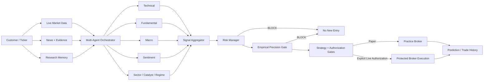
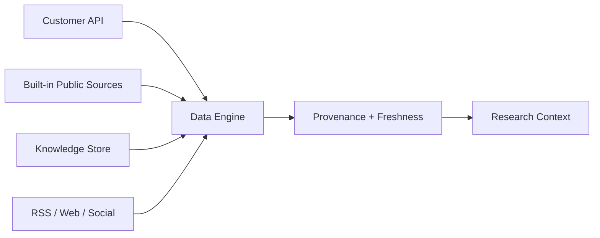

<div align="center">


# AITradra

### AI Trading Intelligence with Safety-First Automation

**Live evidence → Multi-agent research → Consensus → Risk veto → Precision validation → Protected execution**

<p>
  
  
  
  
  
  
  
  
</p>

[Product](#product) · [Architecture](#architecture) · [Trading Safety](#trading-safety) · [Precision Gate](#empirical-precision-gate) · [Monitoring](#operations--health-monitoring) · [Quick Start](#quick-start) · [Contribute](#community--contributors) · [Investors](#investor--startup-materials)

</div>

<p align="center">
  
</p>

> [!IMPORTANT]
> **AITradra does not guarantee profit, returns, 99% future trade accuracy, or investment outcomes.** The configured 99% value is an **empirical directional-precision eligibility target** for autonomous live entries. Practice trading remains the default and real-money execution is fail-closed.

---

## Product

AITradra is an open-source **AI-native market intelligence and trading engineering platform** that combines real market data, news evidence, multi-agent analysis, prediction measurement, risk controls, practice execution and explicitly gated live execution.

The product is designed around one principle:

> **AI should explain the evidence and survive the risk checks before it can reach an execution path.**

### What customers can do

| Capability | Customer outcome |
|---|---|
| **Market Intelligence** | Understand price action, context, evidence and key risks |
| **Multi-Agent Research** | Compare technical, fundamental, macro, sentiment, sector and catalyst views |
| **Prediction Tracking** | See direction, confidence, target, timestamp and later measured outcome |
| **News Evidence** | Inspect recent headlines, sources and likely market impact |
| **Risk Dynamics** | Review volatility, drawdown, position risk and protective levels |
| **AI Expert Chat** | Ask plain-language questions using the shared research stack |
| **Paper Trading** | Practice with reference prices, slippage, fees and persistent positions |
| **Manual Live Trading** | Use a separately authorized Hyperliquid execution path |
| **Autonomous Trading** | Remains separately gated by strategy, risk, precision and authorization controls |
| **Health Monitoring** | CI and recurring live-network smoke checks validate critical data/decision paths |

### Customer decision flow

```text
WHAT HAPPENED
      ↓
WHY IT MAY HAVE HAPPENED
      ↓
EVIDENCE + SOURCE PROVENANCE
      ↓
MULTI-AGENT VIEW
      ↓
SIGNAL AGGREGATION
      ↓
RISK MANAGER VETO
      ↓
EMPIRICAL PRECISION GATE
      ↓
PAPER OR EXPLICITLY AUTHORIZED EXECUTION
      ↓
MEASURED OUTCOME
```

---

## Why AITradra Is Different

AITradra is not designed as a black-box “AI says BUY” interface.

It separates:

- **data collection** from interpretation;
- **specialist analysis** from signal aggregation;
- **confidence** from measured historical precision;
- **research** from execution permission;
- **manual live trading** from autonomous trading;
- **new entries** from reduce-only safety exits;
- **paper evidence collection** from funded execution.

That separation makes the system easier to inspect, test and improve without weakening the safety boundary.

---

## Architecture

<p align="center">
  
</p>



### Core layers

| Layer | Main responsibility |
|---|---|
| Customer UI | Research, portfolio, connections, trading and operational views |
| Data Engine | Market price, OHLCV, customer APIs, cache/freshness and fallbacks |
| Evidence | RSS, news, social provenance and source-aware research context |
| Agent Network | Specialist analysis, critique, aggregation and reasoning |
| Risk | Position limits, daily-loss breaker, reserve, leverage and protection checks |
| Precision | Resolved directional evidence and statistical execution eligibility |
| Execution | Practice broker, manual Hyperliquid adapter and autonomous Hyperliquid path |
| Measurement | Prediction outcomes, accuracy store, reflection and self-improvement telemetry |
| Operations | Safety CI, frontend build, recurring live-system smoke and artifacts |

---

## Multi-Agent Intelligence

The research stack can include:

- Technical Specialist
- Fundamental Specialist
- Macro Specialist
- Sentiment Specialist
- FinBERT sentiment refinement
- Sector Specialist
- Catalyst Specialist
- Breakout / Momentum analysis
- Regime Detector
- Signal Aggregator
- Risk Manager
- Critique / Reflection
- Optional Quantic validation
- Optional Swarm consensus

### Research modes

| Mode | Purpose |
|---|---|
| **QUICK** | Fast market questions and lightweight analysis |
| **DEEP** | Broader research, comparison, risk and pre-trade analysis |
| **INSTITUTIONAL** | Heavier orchestration and additional validation where available |

Manual real-money entry requests require a fresh **DEEP** pre-trade analysis before submission.

---

## Market Data & Evidence

AITradra supports a source-priority model rather than pretending every result has the same quality.



Supported connection presets include:

- Alpha Vantage
- Finnhub
- Twelve Data
- NewsAPI
- GNews
- Hyperliquid
- Custom JSON REST APIs with nested field mapping

Customer credentials are stored locally in an encrypted runtime database and are not returned to the UI after saving.

> [!CAUTION]
> Host-level access can still expose runtime secrets. Serious deployments should use hardened hosts and dedicated secret management.

---

## Trading Safety

AITradra follows a **fail-closed** model.

### Safe defaults

```env
PAPER_TRADE_MODE=true
AUTOTRADE_ENABLED=false
MANUAL_LIVE_TRADING_ENABLED=false
REQUIRE_PROTECTIVE_ORDERS=true
REQUIRE_STRATEGY_VALIDATION=true
REQUIRE_EMPIRICAL_PRECISION_VALIDATION=true
```

### Existing safety controls

- Paper trading by default
- Autonomous startup disabled by default
- Separate manual and autonomous authorization
- Explicit live acknowledgement
- Maximum position percentage
- Maximum daily loss breaker
- Maximum open positions
- Cash reserve requirement
- Leverage cap
- Current-signal confidence gate
- Stop-loss / take-profit validation
- Protective-order enforcement
- Reduce-only close support
- Existing-position add-ons disabled by default
- Strategy validation before autonomous live execution
- Empirical precision validation before autonomous live execution
- Emergency flatten attempt when exchange-side protection fails
- Secret scanning in CI

### Manual live trading

Current customer-connected real execution is **Hyperliquid-focused**. It should not be represented as direct live equity-broker execution.

Manual live and autonomous live are independent permissions. Adding a wallet or broker credential does **not** silently enable autonomous trading.

---

## Empirical Precision Gate

AITradra now distinguishes **model confidence** from **measured directional precision**.

Current default autonomous-live evidence requirements:

```env
AUTOTRADE_TARGET_PRECISION=0.99
AUTOTRADE_MIN_SIGNAL_CONFIDENCE=90.0
AUTOTRADE_MIN_EVALUATED_SIGNALS=100
AUTOTRADE_MIN_PRECISION_LOWER_BOUND=0.95
PRECISION_LOOKBACK_DAYS=90
PRECISION_VALIDATION_MAX_AGE_DAYS=30
```

### What this means

A live autonomous entry is not unlocked because an agent displays “99% confidence.”

The system requires:

1. a non-HOLD actionable signal;
2. current signal confidence at or above the configured live threshold;
3. Risk Manager approval;
4. valid entry / stop / target geometry;
5. approved out-of-sample strategy validation;
6. enough resolved directional outcomes for the ticker and direction;
7. observed directional precision at or above the configured target;
8. a Wilson statistical lower bound at or above the configured threshold;
9. recent enough precision evidence;
10. all existing live authorization and protective-order gates.

If any requirement fails, **the new live entry is blocked**.

> [!NOTE]
> A 99% historical directional target is deliberately difficult to satisfy and is not a promise that future funded trades will be 99% correct or profitable. Spreads, fees, slippage, gaps, latency, regime change and target/stop geometry still affect realized results.

---

## Strategy Validation

Autonomous live trading also requires a separately approved strategy record.

Default thresholds:

```env
STRATEGY_VALIDATION_MAX_AGE_DAYS=30
MIN_BACKTEST_SHARPE=1.0
MAX_BACKTEST_DRAWDOWN_PCT=20.0
MIN_BACKTEST_WIN_RATE=0.52
MIN_BACKTEST_TRADES=30
MIN_BACKTEST_PROFIT_FACTOR=1.20
```

Backtests are validation evidence—not proof of future profitability.

Recommended progression:

```text
Unit / Safety Tests
        ↓
Historical Backtest
        ↓
Out-of-Sample Validation
        ↓
Stress / Sensitivity Tests
        ↓
Paper Forward Test
        ↓
Small Manual Canary
        ↓
Measured Live Track Record
        ↓
Gradual Scaling
```

---

## Operations & Health Monitoring

AITradra now has two complementary monitoring layers.

### 1. Safety CI

`.github/workflows/safety-ci.yml` validates critical Python modules, trading/customer safety regressions, secret scanning and the production React build.

### 2. Live System Smoke

`.github/workflows/live-system-smoke.yml` runs:

- on every pull request;
- on every push to `main`;
- every **4 hours** on a GitHub Actions schedule;
- manually through `workflow_dispatch`.

It verifies real-network market collection, agent consumption, paper execution mechanics, news provenance, social-data fail-closed behavior and autonomous decision gating. Smoke artifacts are uploaded for evidence review.

The smoke environment explicitly keeps:

```env
PAPER_TRADE_MODE=true
AUTOTRADE_ENABLED=false
MANUAL_LIVE_TRADING_ENABLED=false
```

So recurring monitoring does **not** submit a funded live order.

### External status monitoring

An hourly status monitor can inspect the latest GitHub health evidence and report:

- Safety CI state
- Live System Smoke state
- data freshness / provenance
- agent and Risk Manager decision state
- empirical precision-gate readiness
- paper-vs-live mode
- frontend build state
- new failures or regressions

---

## Practice Trading

Practice mode models:

- live/reference market prices when available;
- adverse slippage;
- fees;
- cash and positions;
- realized and unrealized P&L;
- stop-loss and take-profit behavior;
- persistent local practice state.

Default assumptions:

```env
PAPER_STARTING_BALANCE=100000
PAPER_SLIPPAGE_BPS=5
PAPER_FEE_BPS=4
```

---

## Quick Start

### Requirements

- Python 3.12+
- Node.js 22+
- Git
- Optional: Docker
- Optional: NVIDIA NIM / OpenAI-compatible API / Ollama / LM Studio / local model

### Clone

```bash
git clone https://github.com/logeshv586-code/AITradra.git
cd AITradra
cp .env.example .env
```

Keep safe defaults for development:

```env
PAPER_TRADE_MODE=true
AUTOTRADE_ENABLED=false
MANUAL_LIVE_TRADING_ENABLED=false
REQUIRE_PROTECTIVE_ORDERS=true
REQUIRE_STRATEGY_VALIDATION=true
REQUIRE_EMPIRICAL_PRECISION_VALIDATION=true
```

### Backend

```bash
python -m venv venv
```

Linux/macOS:

```bash
source venv/bin/activate
```

Windows PowerShell:

```powershell
.\venv\Scripts\Activate.ps1
```

Then:

```bash
pip install -r requirements.txt
python main.py
```

### Frontend

```bash
cd ui
npm ci
npm run dev
```

Production build:

```bash
npm run build
```

### Docker

```bash
docker compose up --build
```

---

## Testing

Focused safety suites:

```bash
python -m pytest -q \
  tests/test_trading_safety.py \
  tests/test_customer_experience.py \
  tests/test_live_integrity.py \
  tests/test_precision_gate.py
```

Frontend:

```bash
cd ui
npm ci
npm run build
```

---

## Project Structure

```text
AITradra/
├── agents/                 # Specialist, orchestration, signal and risk agents
├── brokers/                # Paper + Hyperliquid execution adapters
├── core/                   # Config, scoring, safety and empirical precision gate
├── docs/                   # Architecture, brand, investor and community assets
├── gateway/                # FastAPI, data engine, runtime and market services
├── memory/                 # Episodic, semantic and prediction memory
├── scheduler/              # Runtime scheduling support
├── self_improvement/       # Outcome scoring, accuracy and precision evidence
├── tests/                  # Safety, customer, live-integrity and precision tests
├── ui/                     # React + Vite application
├── .github/workflows/      # Safety CI + recurring live smoke
├── .env.example
├── docker-compose.yml
├── main.py
└── requirements.txt
```

---

## Current Safety Position

| Area | Status |
|---|:---:|
| Customer-facing market research | ✅ |
| Source-aware live market collection | ✅ |
| Multi-agent signal aggregation | ✅ |
| Risk Manager veto | ✅ |
| Prediction measurement | ✅ |
| Practice execution with fees/slippage | ✅ |
| Manual/autonomous permission separation | ✅ |
| Strategy validation gate | ✅ |
| Empirical precision gate | ✅ |
| Scheduled live-system smoke | ✅ |
| Production frontend build CI | ✅ |
| Autonomous live trading enabled by default | **No** |
| Guaranteed profitability | **No** |
| Guaranteed 99% future trade accuracy | **No** |

---

## Community & Contributors

AITradra is MIT licensed and contributor-friendly.

- [Contribution Guide](CONTRIBUTING.md)
- [Code of Conduct](CODE_OF_CONDUCT.md)
- [Security Policy](SECURITY.md)
- [Public Roadmap](ROADMAP.md)
- GitHub issues include `good first issue` and `help wanted` opportunities

Useful contribution areas include broker/data adapters, India-market coverage, model evaluation, Playwright E2E testing, portfolio intelligence and explainability.

---

## Investor & Startup Materials

The repository includes investor-ready project material:

- [Investor One-Pager](docs/INVESTOR_ONE_PAGER.md)
- [Pitch Deck Outline](docs/PITCH_DECK_OUTLINE.md)
- [90-Second Demo Script](docs/DEMO_SCRIPT_90_SECONDS.md)
- [Investor Data Room Index](docs/INVESTOR_DATA_ROOM_INDEX.md)
- [Launch Posts](docs/LAUNCH_POSTS.md)
- [GitHub Growth Checklist](docs/GITHUB_GROWTH_CHECKLIST.md)

AITradra should be positioned as **AI-native financial intelligence and risk-gated execution infrastructure**, not as a guaranteed-profit trading bot.

---

## Product Principles

```text
Evidence first.
Explanation second.
Risk before execution.
Practice before live.
Explicit authorization before real money.
Measure every prediction.
Do not manufacture accuracy claims.
```

---

## Disclaimer

AITradra is provided for software development, research, education and experimentation. Market data can be delayed, incomplete or wrong. News attribution can be uncertain. Models can fail. Broker APIs can reject, delay or partially execute orders. Stop-loss orders cannot guarantee a specific exit price during gaps, outages or extreme volatility.

Nothing in this repository is financial, investment, legal or tax advice. Anyone enabling real-money trading is responsible for independent review, testing, security, regulation and capital risk.

---

<div align="center">

### AITradra

**Open-source AI trading intelligence built to explain, measure and protect before it executes.**

</div>
