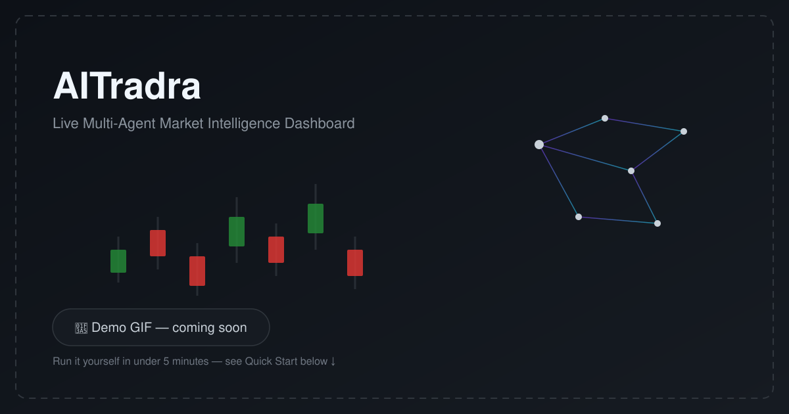

# 🧠 AITradra — High-Conviction Market Intelligence Platform

<p align="center">
  
  
  
  
  
</p>

**A 27-agent AI swarm that watches global markets, argues both sides of every trade in an adversarial Bull-vs-Bear debate, and learns from its own track record — before a single signal reaches your dashboard.**

<p align="center">
  <!-- Replace with a real screen recording (docs/assets/demo.gif) once the dashboard is captured. -->
  
</p>

<!-- Demo Video -->

<p align="center">
  <iframe width="560" height="315" src="https://www.youtube.com/embed/j91tv_Xn3AI?si=6SsImEv7LpQ8QHxz" title="YouTube video player" frameborder="0" allow="accelerometer; autoplay; clipboard-write; encrypted-media; gyroscope; picture-in-picture; web-share" referrerpolicy="strict-origin-when-cross-origin" allowfullscreen></iframe>
</p>

Open source and looking for contributors — quant researchers, ML/LLM engineers, and frontend devs welcome. Jump to [Contributing](#-contributing).

---

## 📚 Table of Contents

- [Intelligence Architecture](#️-intelligence-architecture-the-27-agent-swarm)
- [Core Capabilities](#️-core-capabilities)
- [Tech Stack](#-tech-stack)
- [Project Structure](#-project-structure)
- [Quick Start](#-quick-start)
- [Configuration](#-configuration)
- [Testing](#-testing)
- [Contributing](#-contributing)
- [License](#-license)

---

## 🏗️ Intelligence Architecture (The 27-Agent Swarm)

AITradra operates on a multi-tiered, highly concurrent agent network orchestrated via a central logic loop (AXIOM V4). The system distributes tasks across four distinct operational tiers:

### 📡 Tier 1: v3 Edge Intelligence
Lightweight agents focused on real-time data ingestion, preprocessing, and immediate directional bias.
- **DataCollector**: Streams yFinance and crypto gateway data.
- **BlobStorage**: Manages high-frequency local state persistence.
- **UI API**: Internal interface for frontend state synchronization.

### 🧠 Tier 2: v4 Mythic Core
The heavy reasoning layer. These agents handle complex cross-asset correlation and long-sequence reasoning.
- **MythicOrchestrator**: The central "brain" that delegates to specialists.
- **QueryRouter**: Intelligently routes user queries to the most relevant sub-agent cluster.
- **Swarm Intelligence**: Aggregates output from all specialists into a unified verdict.

### 🛡️ Tier 3: High-Conviction Specialists
Specialized quantitative and qualitative nodes that provide "veto" power or confirmation for signals.
- **QuanticAnalysis (Vibe-AI)**: Computes **Smart Money Concepts (SMC)**, identifying Institutional Order Blocks and Fair Value Gaps (FVG).
- **TechnicalSpecialist**: Analyzes OHLCV patterns and momentum (SMA20/50, RSI).
- **RiskSpecialist**: Computes **VaR 95%**, Beta, Max Drawdown, and Stress Scenarios.
- **MacroSpecialist**: News sentiment, earnings signals, and sector rotation analysis.
- **Forecast / StrategyGen**: Predictive modeling and trade execution plan generation.

### 🔍 Tier 4: Research & Discovery
Deep scanning agents that look for outliers and alpha beyond the primary watchlist.
- **MarketRAG**: Retrieval-augmented generation over market historical archives.
- **NewsIntel / MCPNews**: Deep NLP analysis of global headlines and alternative data.
- **DeepResearch**: Long-form synthesis of sector trends and macro-economic shifts.
- **CommodityImpact**: Real-world causal-chain research — detects commodity price
  events in the news (vegetables, grains, crude, metals…), classifies the root
  cause (flood, drought, export ban, demand surge, supply shock, logistics),
  maps the event to the listed companies it affects (producers benefit, input-cost
  consumers get squeezed), and emits BUY/SELL/WATCH suggestions with entry timing,
  hold horizon, and explicit exit rules. Endpoints: `/api/commodity/events`,
  `/api/commodity/suggestions`, `/api/commodity/exposure/{ticker}`,
  `POST /api/commodity/scan`. Runs automatically on a market-aware schedule
  (hourly while markets are open, 6-hourly otherwise).

---

## ⚙️ Core Capabilities

### 1. Mythic Validation Pipeline (MVP)
Eliminates predictive noise. Before any signal is pushed to the UI, it passes through the "Mythic Consensus" scoring engine:
- **Technical (40%)**: SMA alignment, Volume ratios, and Momentum.
- **News/Sent (40%)**: NLP sentiment scores from 20+ global sources.
- **Social (20%)**: Sentiment trending across public financial forums.
- **Volume Filter**: High-volume "confirmations" apply a 1.2x conviction multiplier.

### 2. Adversarial Research Debate (TradingAgents-style)
No suggestion reaches the user without surviving a structured **Bull vs Bear
debate**: two researchers argue opposite sides across multiple rounds over the
platform's collected evidence (specialist insights, commodity impacts, news
sentiment, price trend, past trade lessons), then a judge issues the verdict.
A three-stance **risk bench** (aggressive / neutral / conservative) blends a
position size from the verdict's confidence and evidence quality. Runs daily
against DeepResearch candidates and on demand via `POST /api/advanced/debate/{ticker}`.
Falls back to deterministic evidence scoring when the LLM is offline.

### 3. Reflection Memory — the Trade-Lesson Decision Log
Every resolved prediction becomes a **lesson**: what the call was, whether it
worked, and what to do differently. Lessons are retrieved before new decisions
(same-ticker history + cross-ticker failure patterns) and injected into the
debate evidence pack, so past mistakes argue in the room alongside fresh
signals. Endpoints: `/api/advanced/lessons`, `/api/advanced/lessons/{ticker}`.

### 4. SkillOptimizer — Train Prompts Like Weights (SkillOpt-style)
The model stays frozen; each agent's **learned rules document** is the
trainable state. Weekly epochs: score outcomes → propose ≤3 edits (textual
learning rate) → apply as a new version → **validation gate** — if the agent's
windowed accuracy degrades beyond tolerance, the version is rolled back and
its edits land in a rejected-edit buffer, never to be re-proposed. Learned
rules are injected into prompts through the SkillManager with zero extra
inference cost. Endpoints: `/api/advanced/skills/status`, `POST /api/advanced/skills/epoch`.

### 5. Quantitative Diagnostic Engine
Powered by **Vibe-Trading AI**, the platform executes institutional-grade simulations:
- **Monte Carlo Simulations**: Runs 10,000 parallel market iterations to visualize the probability distribution of returns.
- **Bootstrap Validation**: Executes 5,000 sampling tests to verify the statistical significance of identified trends.
- **Institutional SMC**: Identifies liquidity pools and fair-price imbalances used by top-tier funds.

### 6. Continuous Self-Improvement
The **AccuracyStore** background orchestrator continuously evaluates prediction outcomes against real price action (>24h lag). It grades agents individually, adjusting their "Influence Weight" in the ensemble.

---

## 🧪 Tech Stack

- **Frontend**: React 19, Vite 8, Tailwind CSS v4, Lucide, Recharts, react-three-fiber.
- **Backend**: FastAPI (Python 3.12), APScheduler, Uvicorn.
- **AI Infrastructure**: LM Studio (Local Inference @ port 1234), NVIDIA NIM (Cloud Scaling), OpenAI-compatible providers (OpenRouter, Groq, Together, etc.).
- **Orchestration**: LangGraph, CrewAI, LangChain.
- **Data & Quant**: Pandas-TA, NumPy, Scikit-learn, vectorbt, backtrader, pyportfolioopt.
- **Memory**: Chroma / Qdrant (Vector Store), SQLite (Accuracy Leaderboard), JSON Persistence.

## 🗂 Project Structure

```
AITradra/
├── agents/          # The 27-agent swarm (tiered specialists, legacy agents)
├── autoresearch/     # DeepResearch & discovery agents
├── brokers/          # Broker/exchange integrations
├── core/             # Mythic pipeline, orchestration, shared domain logic
├── gateway/           # Market data blob storage, scrapers, RAG index
├── ingestion/         # Data collectors and preprocessing
├── llm/               # LLM provider adapters (NVIDIA NIM, OpenAI-compatible, local)
├── mcp/               # MCP tool integrations
├── memory/            # Semantic + structured (reflection/lesson) memory
├── scheduler/         # APScheduler jobs (news, price, RAG reindex)
├── scrapers/          # News & alternative data scrapers
├── self_improvement/  # AccuracyStore & SkillOptimizer
├── skills/             # Agent "learned rules" documents
├── tests/              # Pytest suite
├── ui/                 # React 19 + Vite frontend
├── main.py             # FastAPI entrypoint / API gateway
├── market_rag.py        # Retrieval-augmented generation over market history
└── docker-compose.yml   # Multi-service local deployment
```

## 🚀 Quick Start

### Prerequisites
- Python 3.12+
- Node.js 18+ (for the frontend)
- (Optional) [LM Studio](https://lmstudio.ai/) for private local inference, or an NVIDIA NIM / OpenAI-compatible API key

### 1. Clone & configure
```bash
git clone https://github.com/logeshv586-code/AITradra.git
cd AITradra
cp .env.example .env   # fill in your API keys / provider config
```

### 2. Backend
```bash
python -m venv venv && source venv/bin/activate   # or venv\Scripts\activate on Windows
pip install -r requirements.txt
python main.py   # starts the 27-agent heartbeat and API Gateway on :8000
```

### 3. Frontend
```bash
cd ui
npm install
npm run dev
```

### 4. (Optional) Docker
```bash
docker-compose up --build
```

## ⚙️ Configuration

All runtime configuration is driven by environment variables — see [`.env.example`](./.env.example) for the full list, including:

- **LLM provider**: `LLM_PROVIDER` (`nvidia_nim`, `openai_compatible`, or local models via LM Studio/Ollama).
- **Risk controls**: `PAPER_TRADE_MODE`, `MAX_POSITION_PCT`, `MAX_DAILY_LOSS_PCT`, `MAX_OPEN_POSITIONS`, `MIN_SIGNAL_CONFIDENCE`, `MIN_CONSENSUS_AGENTS`.
- **Scheduler cadence**: `NEWS_FETCH_INTERVAL_MIN`, `PRICE_FETCH_INTERVAL_MIN`, `RAG_REINDEX_INTERVAL_MIN`.

The platform defaults to **paper-trade mode** — no live orders are placed unless you explicitly configure a broker and disable `PAPER_TRADE_MODE`.

## 🧪 Testing

```bash
pytest tests/
```

Covers the Mythic validation pipeline, advanced intelligence (debate/lessons/skills), commodity-impact engine, mission control, sentiment, and API performance.

---

## 🤝 Contributing

We'd love your help making AITradra better! Whether it's a new specialist agent, a bug fix, better test coverage, docs, or UI polish — all contributions are welcome.

1. **Fork** the repository and create your branch from `main`:
   `git checkout -b feature/my-improvement`
2. **Set up** the project locally using the [Quick Start](#-quick-start) above.
3. **Make your changes** — keep commits focused and write clear messages.
4. **Test** your changes: `pytest tests/` (backend) and `npm run lint` (frontend).
5. **Open a Pull Request** describing what you changed and why. Link any related issues.

### Good places to start
- 🐛 Check open [Issues](https://github.com/logeshv586-code/AITradra/issues) for bugs and feature requests.
- 🧠 Add or refine a specialist agent in `agents/`.
- 📊 Improve the Mythic Validation Pipeline scoring in `core/`.
- 🎨 Polish the React dashboard in `ui/`.
- 📝 Improve documentation — architecture notes live in `docs/`.

If you're planning a larger change, please open an issue first to discuss the approach. For anything unclear, feel free to open a discussion or draft PR — new contributors are always welcome.

## 📄 License

Released under the [MIT License](./LICENSE).

---

*AITradra: Institutional Intelligence, Democratized.*
