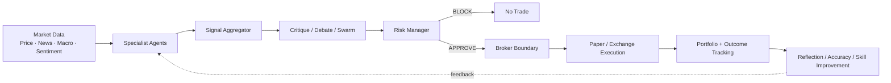
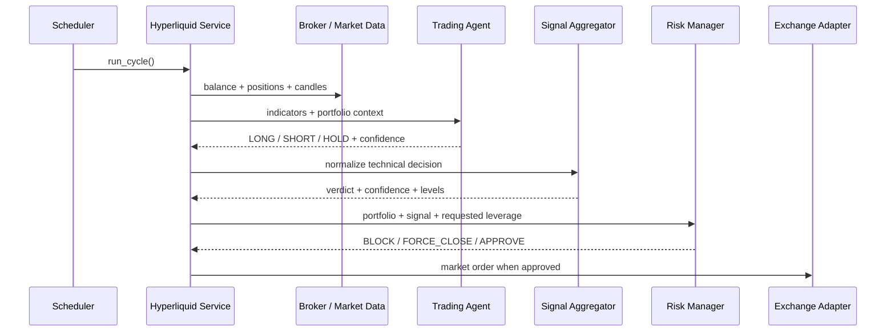

<div align="center">

# AITradra

### Multi-Agent Market Intelligence, Risk-Gated Decisioning & Experimental Trading Automation

**Research signals. Challenge assumptions. Size risk. Validate before capital.**

<p>
  
  
  
  
  
  
</p>

[Architecture](#-system-architecture) · [Trading Flow](#-trading-decision-flow) · [Safety](#-trading-readiness-audit) · [Quick Start](#-quick-start) · [Validation Roadmap](#-profitability-validation-roadmap)

</div>

<p align="center">
  
</p>

> [!IMPORTANT]
> **AITradra is an experimental market-research and paper-trading platform. It does not guarantee profit, returns, or investment outcomes.** The repository contains a live-broker integration, but the current execution path still has safety and validation gaps documented below. Keep live trading disabled until those gates are closed and independently tested.

---

## Why AITradra

AITradra combines market data, quantitative indicators, LLM reasoning, multi-agent debate, signal fusion, portfolio risk rules, memory, and broker adapters into one research stack.

Instead of letting a single model directly place a trade, the intended architecture is:

1. **Collect evidence** from price, news, macro, sentiment, fundamentals, sector and catalyst sources.
2. **Run specialist agents** that produce independent views.
3. **Fuse signals** into a normalized market verdict and calibrated confidence.
4. **Challenge the thesis** through critique, debate, swarm and optional quantic validation.
5. **Apply deterministic risk controls** before an order can be approved.
6. **Execute only through an explicit broker boundary**.
7. **Record outcomes** for reflection, accuracy tracking and future improvement.

The goal is not to make AI sound confident. The goal is to make every trading decision **traceable, challengeable and measurable**.

---

## System Architecture

<p align="center">
  
</p>

### Intelligence pipeline

<p align="center">
  
</p>



### Major layers

| Layer | Responsibility | Key modules |
|---|---|---|
| **Data & Research** | Prices, news, macro, RAG, commodity and alternative-data context | `agents/collector_agent.py`, `gateway/`, `ingestion/`, `scrapers/` |
| **Specialists** | Technical, risk, macro, sentiment, fundamentals, sector and catalysts | `agents/specialist_agents.py`, `agents/extended_specialists.py` |
| **Decision Fusion** | Weighted signal fusion, confidence calibration, regime and debate | `agents/signal_aggregator.py`, `core/scoring.py`, `agents/critique_layer.py` |
| **Risk Gate** | Position cap, daily-loss gate, reserve, leverage cap, Kelly sizing, stop/target calculation | `agents/risk_manager.py` |
| **Execution** | Paper broker, CCXT adapter and Hyperliquid adapter | `brokers/` |
| **Automation** | Scheduled market intelligence and experimental trading cycles | `main.py`, `core/market_scheduler.py`, `gateway/hyperliquid_service.py` |
| **Learning** | Outcome tracking, reflection, skill optimization and memory | `self_improvement/`, `memory/`, `gateway/knowledge_store.py` |
| **Experience** | FastAPI backend + React mission-control UI | `gateway/server.py`, `ui/` |

---

## Trading Decision Flow

The active Hyperliquid path currently follows this chain:



### Signal fusion

The core scoring engine uses a normalized weighted blend:

```text
Consensus = Technical × 0.40
          + News      × 0.35
          + Social    × 0.15
          + Volume    × 0.10
```

High-volume confirmation can apply a conviction multiplier. Confidence is then calibrated using signal magnitude, data depth, news coverage and agent agreement before the recommendation gate is applied.

### Risk controls implemented in code

The risk manager contains controls for:

- maximum open positions;
- daily portfolio loss blocking;
- force-close loss threshold;
- minimum cash reserve;
- leverage capping;
- confidence gating;
- half-Kelly position sizing with a hard position cap;
- volatility-regime size reduction;
- generated stop-loss and take-profit levels.

These are useful **decision-layer controls**, but production safety also requires enforcement at the broker/exchange boundary. See the audit below.

---

## Trading Readiness Audit

> [!WARNING]
> **Current verdict: research/paper-trading capable; live autonomous trading is not yet production-ready. Profitability has not been established.**

| Area | Current state | Readiness |
|---|---|:---:|
| Multi-agent research | Broad specialist + debate architecture exists | 🟢 |
| Signal fusion | Deterministic weighted scoring + confidence calibration | 🟢 |
| Risk manager | Strong rule set exists at decision layer | 🟡 |
| Paper portfolio UI | Uses live/near-live market prices for portfolio simulation | 🟡 |
| Generic paper broker | Market fills can fall back to a fixed placeholder price | 🔴 |
| Hyperliquid paper execution | Returns synthetic fills but does not model realistic exchange P&L | 🔴 |
| Daily-loss protection | Risk manager supports it, but the Hyperliquid service does not currently populate `daily_pnl_pct` | 🔴 |
| Stop-loss / take-profit | Levels are calculated, but the approved Hyperliquid market order does not currently carry or place them | 🔴 |
| Force-close routing | Risk result can identify a position, but execution should be hardened to close the exact risk-selected ticker | 🔴 |
| Candle consistency | Signal code and service use different ends of the OHLCV array as the latest bar; ordering must be normalized | 🔴 |
| Execution-mode control | `PAPER_TRADING` and `PAPER_TRADE_MODE` both exist; one authoritative mode flag is required | 🔴 |
| Autonomous startup | Trading cycle is scheduled automatically during application startup | 🟡 |
| Backtesting | Backtrader implementation exists under `agents/legacy/`; not yet an enforced deployment gate | 🟡 |
| Transaction costs | Basic legacy backtest commission exists; realistic slippage, spread, funding and latency are not consistently modeled | 🔴 |
| Walk-forward / OOS | No mandatory walk-forward and untouched out-of-sample gate in the live path | 🔴 |
| Broker/risk regression tests | Existing tests focus on intelligence/API subsystems rather than the full money path | 🔴 |
| GitHub Actions CI | No repository workflow is currently present | 🔴 |
| Profitability evidence | No audited, reproducible live/paper track record establishes future profitability | 🔴 |

### Critical live-trading blockers

Before using real capital, close these in order:

1. **Create one execution-mode source of truth.** Remove the split between `PAPER_TRADING` and `PAPER_TRADE_MODE`.
2. **Add an explicit `ENABLE_AUTOTRADE=false` kill switch.** Starting the API should not be enough to authorize live autonomous trading.
3. **Enforce risk at the execution boundary.** A broker should reject orders that violate position, loss, leverage or protection rules even if an upstream agent fails.
4. **Place exchange-native protection orders.** A calculated stop is not protection until it is actually resting on the venue or managed by a tested fail-safe executor.
5. **Feed real daily P&L into the risk manager.** Otherwise the daily-loss circuit breaker cannot trigger.
6. **Fix force-close symbol routing.** Always execute against the ticker returned by the risk decision.
7. **Normalize candle ordering and interval windows.** All agents must agree on oldest/newest bar semantics and requested lookback duration.
8. **Model fills realistically.** Include bid/ask spread, fees, funding, slippage, latency, partial fills and rejected orders.
9. **Move backtesting out of legacy and make it a deployment gate.** No strategy should reach live mode without a reproducible validation artifact.
10. **Add CI tests for the entire money path.** Signal → risk → order construction → broker → portfolio state must be covered before merge.

---

## Profitability Validation Roadmap

A profitable historical chart is not enough. A strategy should have to pass several independent gates before capital is increased.

```mermaid
flowchart LR
    A[Strategy / Signal Change] --> B[Unit + Risk Tests]
    B --> C[Historical Backtest]
    C --> D[Walk-Forward Validation]
    D --> E[Untouched Out-of-Sample]
    E --> F[Monte Carlo / Stress]
    F --> G[Paper Shadow Trading]
    G --> H[Tiny-Capital Canary]
    H --> I[Scale Gradually]
    I --> J[Continuous Kill-Switch Monitoring]
```



### Minimum validation evidence to track

| Category | Metrics / evidence |
|---|---|
| Return quality | Total return, CAGR, expectancy, profit factor |
| Risk-adjusted return | Sharpe, Sortino, Calmar |
| Drawdown | Max drawdown, recovery duration, underwater curve |
| Trade quality | Win rate, average win/loss, payoff ratio, trade count |
| Execution realism | Fees, spread, slippage, funding, latency, rejected/partial fills |
| Robustness | Walk-forward results, untouched OOS, parameter sensitivity |
| Tail risk | Monte Carlo drawdown distribution, gap/stress scenarios |
| Stability | Performance by regime, asset, long/short side and calendar period |
| Live similarity | Paper-vs-backtest and live-vs-paper drift |

> [!NOTE]
> A model should be rejected or reduced when performance depends on one period, one symbol, one parameter set, unrealistic fills, data leakage, or repeated strategy tuning against the same test set.

---

## Core Capabilities

<table>
<tr>
<td width="50%" valign="top">

### 🧠 Multi-Agent Intelligence
- Mythic orchestrator
- Technical / macro / risk specialists
- Sentiment + FinBERT refinement
- Fundamental / sector / catalyst agents
- Critique and reflection layer
- Optional swarm and quantic validation

</td>
<td width="50%" valign="top">

### 📊 Quant & Market Analysis
- OHLCV technical scoring
- ATR-based stop/target generation
- Volatility regimes
- Kelly sizing
- Monte Carlo-oriented analysis hooks
- Backtrader / vectorbt dependencies

</td>
</tr>
<tr>
<td width="50%" valign="top">

### 🛡️ Risk & Execution
- Max-position controls
- Daily-loss circuit breaker logic
- Cash reserve and leverage caps
- Paper broker
- CCXT adapter
- Hyperliquid adapter

</td>
<td width="50%" valign="top">

### ♻️ Learning & Memory
- Prediction storage
- Accuracy tracking
- Reflection lessons
- Skill optimizer
- Semantic / structured memory
- Market RAG

</td>
</tr>
</table>

---

## Project Structure

```text
AITradra/
├── agents/                 # Active specialists, orchestration, debate, legacy agents
│   └── legacy/             # Older/experimental agents, including current BacktestAgent
├── autoresearch/           # Research automation
├── brokers/                # Paper / CCXT / Hyperliquid execution adapters
├── core/                   # Configuration, scoring, scheduler and shared domain logic
├── docs/                   # Architecture diagrams and documentation assets
├── gateway/                # FastAPI services, simulation, knowledge and trading services
├── ingestion/              # Data ingestion pipeline
├── llm/                    # Model/provider clients
├── mcp/                    # MCP integrations
├── memory/                 # Persistent and semantic memory
├── scheduler/              # Scheduling support
├── scrapers/               # Market/news scraping adapters
├── self_improvement/       # Accuracy, scoring and skill optimization
├── skills/                 # Agent rule/skill documents
├── tests/                  # Pytest intelligence/API test suite
├── tools/                  # Indicators and shared utilities
├── ui/                     # React + Vite mission-control interface
├── .env.example            # Safe configuration template
├── docker-compose.yml      # Local multi-service stack
├── main.py                 # Unified API + scheduler entry point
└── requirements.txt        # Python dependencies
```

---

## Tech Stack

| Area | Stack |
|---|---|
| Backend | Python 3.12+, FastAPI, Uvicorn, APScheduler |
| Frontend | React 19, Vite, Tailwind CSS, Recharts |
| Agent orchestration | Custom agents, LangGraph, CrewAI, LangChain |
| Model providers | NVIDIA NIM, OpenAI-compatible providers, local GGUF/Ollama fallbacks |
| Quant | Pandas, NumPy, pandas-ta, vectorbt, Backtrader, PyPortfolioOpt |
| Market data | yfinance, OpenBB integrations, custom collectors/scrapers |
| Memory | SQLite, Chroma/Qdrant, Mem0, FAISS |
| Trading | Internal paper simulator, CCXT adapter, Hyperliquid SDK |
| Infrastructure | Docker Compose, Redis, Kafka, Timescale/Postgres, Qdrant, MinIO, Ollama |

---

## Quick Start

### Prerequisites

- Python 3.12+
- Node.js 18+
- Git
- Optional: Docker / Docker Compose
- Optional: NVIDIA NIM, OpenAI-compatible provider, Ollama or local GGUF models

### 1. Clone

```bash
git clone https://github.com/logeshv586-code/AITradra.git
cd AITradra
```

### 2. Configure environment

```bash
cp .env.example .env
```

For development and evaluation, keep paper execution enabled:

```env
PAPER_TRADE_MODE=true
PAPER_TRADING=true
```

`PAPER_TRADING` is currently retained for compatibility with the generic broker router. The execution-mode flags should be unified before live deployment.

> [!CAUTION]
> Never commit API keys, exchange private keys, wallet secrets or tokens. Keep them in `.env` / a secret manager and rotate any credential that has ever been committed to repository history.

### 3. Backend

```bash
python -m venv venv

# Linux/macOS
source venv/bin/activate

# Windows PowerShell
# .\venv\Scripts\Activate.ps1

pip install -r requirements.txt
python main.py
```

API: `http://localhost:8000`

### 4. Frontend

```bash
cd ui
npm install
npm run dev
```

### 5. Docker stack

```bash
docker compose up --build
```

> [!WARNING]
> The current application startup schedules the Hyperliquid trading cycle automatically. Keep paper mode enabled until a separate explicit auto-trade authorization switch and the execution safeguards in this README are implemented.

---

## Configuration

Start from [`.env.example`](./.env.example).

### LLM

```env
LLM_PROVIDER=nvidia_nim
MOONSHOT_API_KEY=
NEMOTRON_API_KEY=
MINIMAX_API_KEY=
MISTRAL_API_KEY=

OPENAI_COMPATIBLE_BASE_URL=https://api.openai.com/v1
OPENAI_COMPATIBLE_API_KEY=
OPENAI_COMPATIBLE_MODEL=gpt-4o-mini
```

### Risk

```env
PAPER_TRADE_MODE=true
MAX_POSITION_PCT=0.05
MAX_DAILY_LOSS_PCT=0.02
MAX_OPEN_POSITIONS=5
MIN_SIGNAL_CONFIDENCE=0.70
MIN_CONSENSUS_AGENTS=3
```

### Scheduler

```env
NEWS_FETCH_INTERVAL_MIN=10
PRICE_FETCH_INTERVAL_MIN=5
RAG_REINDEX_INTERVAL_MIN=15
```

---

## Testing

Current local suite:

```bash
pytest tests/
```

Frontend checks:

```bash
cd ui
npm run lint
```

### Recommended next tests

The highest-value additions are broker and money-path tests:

```text
signal aggregation
    ↓
risk decision
    ↓
position sizing
    ↓
stop / target construction
    ↓
order routing
    ↓
paper/live broker boundary
    ↓
portfolio + realized P&L update
```

Add deterministic fixtures for stale data, zero balance, max positions, daily-loss breach, exchange errors, slippage, partial fills, stop execution and emergency kill-switch behavior.

---

## Security & Safety

- Keep credentials in environment variables or a secret manager only.
- Use separate exchange accounts/wallets for research and live trading.
- Start with read-only / paper permissions wherever possible.
- Never make API startup equivalent to live-trading authorization.
- Add a hard emergency stop that can be triggered outside the model/agent stack.
- Reconcile exchange positions and local state before every live decision cycle.
- Treat LLM output as **untrusted input**; deterministic risk logic must remain authoritative.
- Log every signal, risk decision, order request, exchange acknowledgement and portfolio mutation.

---

## Contributing

Contributions are welcome across quant research, execution safety, agent evaluation, backend, frontend and documentation.

```bash
git checkout -b feature/my-improvement
pytest tests/
```

High-impact contribution areas:

- execution-mode unification and kill switch;
- broker/risk integration tests;
- exchange-native stop-loss / take-profit handling;
- realistic fill + fee + funding simulation;
- active walk-forward / out-of-sample backtesting;
- portfolio reconciliation and P&L circuit breakers;
- GitHub Actions CI;
- reproducible benchmark datasets and evaluation reports;
- dashboard observability for risk and execution state.

---

## License

Released under the [MIT License](./LICENSE).

---

<div align="center">

### AITradra

**Intelligence is useful. Risk control is mandatory. Profitability must be proven.**

</div>
