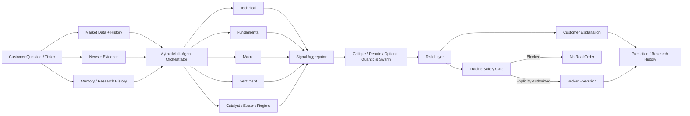
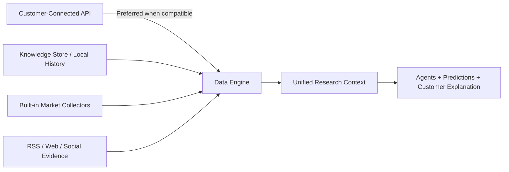
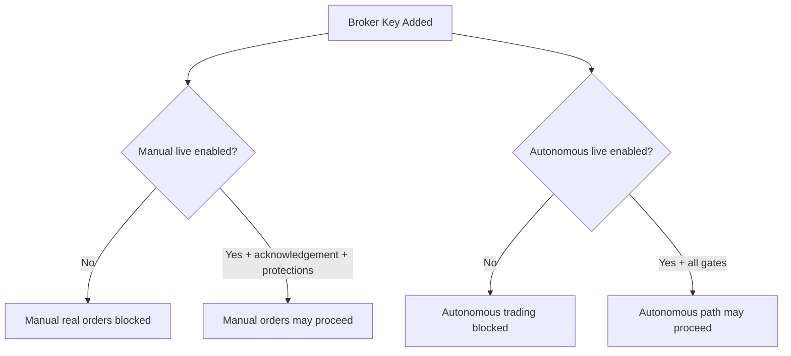
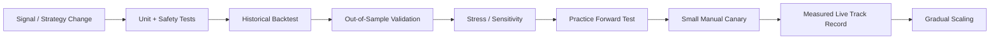

<div align="center">

# AITradra

### Customer-First Multi-Agent Market Intelligence, Research & Risk-Gated Trading

**Understand what moved. See why it moved. Compare the evidence. Measure the risk. Trade only through explicit safety gates.**

<p>
  
  
  
  
  
  
  
  
</p>

[Customer Experience](#-customer-experience) · [Architecture](#-system-architecture) · [Data Sources](#-market-data--news) · [Trading](#-practice--real-trading) · [Safety](#-trading-safety-model) · [Quick Start](#-quick-start)

</div>

<p align="center">
  
</p>

> [!IMPORTANT]
> **AITradra is a market-research, prediction-tracking and trading-engineering platform. It does not guarantee profits, returns, signal accuracy, or investment outcomes.** Practice trading is the default. Real-money execution is intentionally fail-closed and must be explicitly enabled by the deployment owner.

---

## What AITradra Is

AITradra brings market data, news, technical analysis, fundamentals, sentiment, macro context, risk models, multi-agent reasoning, prediction history and broker execution into one customer-facing application.

The product is designed so a non-developer can open the app and answer practical questions such as:

- **What happened to this stock today?**
- **Why did the price move?**
- **Which news or market factors may have contributed?**
- **What do the AI agents currently agree or disagree about?**
- **What is the prediction and how confident is it?**
- **What are the major risks?**
- **What should I watch next before making a decision?**
- **How has AITradra performed on previous predictions?**

AITradra deliberately separates **research**, **practice trading**, **manual real trading**, and **autonomous trading permissions** so a data connection or broker key alone cannot silently authorize real-money automation.

---

## Customer Experience

The existing global application shell remains the stable starting point: global market navigation, ticker context, top-level market visibility and the left sidebar stay consistent while each page focuses on a clear customer task.

### Main customer pages

| Page | What the customer gets |
|---|---|
| **World Map** | Global market visibility and geographic market context |
| **Predictions** | Current price, daily move, AI direction, confidence, target, risk and primary reason |
| **Stock Terminal** | Price action, fundamentals, what happened, why it happened, evidence, prediction, risk and what to watch next |
| **Intelligence** | Movers, gainers, losers and research opportunities presented in simple language |
| **Intelligence Status** | Data readiness, prediction track record, trading readiness and connection controls |
| **Agent Network** | A customer-readable explanation of how the specialist AI services are contributing |
| **News Evidence** | Recent headlines, likely impact, timestamps and source evidence |
| **Risk Dynamics** | Volatility, drawdown, risk tier, VaR-style measures and key risk factors |
| **AI Expert Chat** | Plain-language market questions answered using the shared research stack |
| **Portfolio** | Research coverage plus practice and connected real-account capital shown separately |
| **Paper Trading** | Practice trading and a separately gated Real Trading workspace inside the same page |
| **Mission Control** | Research history, data collection status and customer-level operational visibility |
| **Network Pulse** | Simple market/data/AI readiness rather than low-level developer diagnostics |

### Customer answer format

The research experience is built around a consistent mental model:

```text
WHAT HAPPENED
      ↓
WHY IT MAY HAVE HAPPENED
      ↓
EVIDENCE & SOURCES
      ↓
MULTI-AGENT VIEW
      ↓
PREDICTION + CONFIDENCE
      ↓
RISK
      ↓
WHAT TO WATCH NEXT
```

The objective is not to expose internal model plumbing. The objective is to convert the available evidence into a clear, inspectable market explanation.

---

## System Architecture

<p align="center">
  
</p>

### Customer research pipeline

<p align="center">
  
</p>



### Major layers

| Layer | Responsibility | Key modules |
|---|---|---|
| **Customer Experience** | Customer-first views, chat, connections and trading workspace | `ui/src/components/` |
| **Connected Data** | Encrypted customer API/broker configuration and custom JSON adapters | `gateway/customer_runtime.py`, `gateway/connected_source_adapter.py` |
| **Market Data** | Price, OHLCV, news, social evidence and built-in public/open fallbacks | `gateway/data_engine.py`, `agents/collector_agent.py`, `gateway/scrapers/` |
| **Knowledge & History** | Local market history, evidence, prediction state and research memory | `gateway/knowledge_store.py`, `memory/`, `gateway/customer_runtime.py` |
| **Multi-Agent Research** | Technical, macro, fundamental, sentiment, sector, catalyst and regime analysis | `agents/orchestrator.py`, `agents/specialist_agents.py`, `agents/extended_specialists.py` |
| **Decision Fusion** | Signal normalization, consensus and calibrated confidence | `agents/signal_aggregator.py`, `core/scoring.py`, `agents/critique_layer.py` |
| **Risk** | Daily-loss gate, position limits, leverage caps, reserve logic and protective levels | `agents/risk_manager.py`, `core/trading_safety.py` |
| **Execution** | Practice broker, Alpaca paper/live adapter, generic routing, autonomous Hyperliquid path and manual Hyperliquid adapter | `brokers/`, `gateway/hyperliquid_service.py` |
| **Validation** | Out-of-sample strategy checks, prediction scoring and safety regressions | `agents/legacy/backtest_agent/`, `tests/`, `.github/workflows/safety-ci.yml` |

---

## Multi-Agent Intelligence

AITradra reuses one shared orchestration stack instead of building separate decision engines for every screen.

The research path can involve:

- Technical Specialist
- Fundamental Specialist
- Macro Specialist
- Sentiment Specialist
- FinBERT sentiment refinement
- Sector Specialist
- Catalyst Specialist
- Breakout / Momentum analysis
- Regime Detector
- Signal Aggregator
- Risk Manager
- Critique / Reflection
- Optional Quantic analysis
- Optional Swarm consensus
- Cross-market sanity checks in deeper research modes

### Research modes

| Mode | Use case |
|---|---|
| **QUICK** | Fast customer questions and lightweight signal aggregation |
| **DEEP** | Full research, comparison, risk analysis and pre-trade analysis |
| **INSTITUTIONAL** | Heavier orchestration with additional validation layers where available |

Real manual orders trigger a fresh **DEEP** pre-trade research pass before submission.

---

## Market Data & News

AITradra is designed to work without forcing every user to purchase a data API on day one.

### Data priority



The system prefers a compatible user-connected source when configured, while retaining built-in public/open collection as a fallback.

### Supported connection presets

The customer connection panel supports presets for:

- **Alpha Vantage**
- **Finnhub**
- **Twelve Data**
- **Polygon.io**
- **NewsAPI**
- **GNews**
- **Hyperliquid**
- **Custom JSON REST API**

Custom JSON sources can be configured for either market-price data or news data and can map nested JSON field paths.

### Credential storage

Customer API and broker credentials are stored locally in an encrypted runtime database using Fernet encryption.

They are **not** returned to the UI after saving and runtime credential files are excluded from source control.

Relevant ignored runtime files include:

```text
data/customer_runtime.sqlite3
data/.customer_runtime.key
```

> [!CAUTION]
> Local encryption protects credentials at rest from casual disclosure, but anyone with full access to the application host may be able to access the runtime and encryption key. Use host-level security and a dedicated secret manager for serious deployments.

---

## Everyday Collection & Research Memory

AITradra maintains a local market knowledge layer so answers can use more than a single live quote.

The background collection system supports:

- recurring price refreshes during relevant market windows;
- recurring news collection;
- RSS catch-up on startup when local news history is empty;
- local OHLCV persistence;
- cached market intelligence snapshots;
- research/prediction history;
- background evidence warming for requested tickers;
- configured refresh intervals through `.env`.

Default timing controls include:

```env
NEWS_FETCH_INTERVAL_MIN=10
PRICE_FETCH_INTERVAL_MIN=5
RAG_REINDEX_INTERVAL_MIN=15
```

### Default history profile

Until a full authentication layer is introduced, customer research/trading history uses one local history identity:

```text
default
```

This identity is used only for local research and trading history. It is not a security boundary or multi-user authentication system.

---

## Prediction Experience

Predictions are presented as **decision support**, not guaranteed trade signals.

A prediction record can include:

- current price;
- daily price move;
- direction;
- confidence;
- expected move;
- target price;
- primary driver;
- risk level;
- intelligence/data-quality grade;
- timestamp;
- reasoning summary.

AITradra also tracks resolved predictions so customers can judge historical performance rather than relying only on current confidence values.

---

## Practice & Real Trading

The existing Trading page separates two very different workflows.

### 1. Practice Trading

Practice mode is the default and is designed for learning, strategy inspection and forward testing.

It models:

- live/reference market prices when available;
- configurable slippage;
- configurable fees;
- cash and positions;
- realized and unrealized P&L;
- long/short state where supported;
- stop-loss and take-profit behavior;
- persistent local practice state.

Default paper assumptions:

```env
PAPER_STARTING_BALANCE=100000
PAPER_SLIPPAGE_BPS=5
PAPER_FEE_BPS=4
```

### 2. Manual Real Trading

Manual real trading is a separate permission path.

**Current customer-connected real execution is implemented for Hyperliquid.** AITradra can research equities, ETFs, crypto and other supported market symbols, but the manual real broker adapter should not be interpreted as direct live stock-broker execution.

A new manual real-money order requires:

1. A saved compatible broker connection.
2. `PAPER_TRADE_MODE=false` on the deployment host.
3. `MANUAL_LIVE_TRADING_ENABLED=true`.
4. The exact live acknowledgement configured.
5. Protective-order enforcement enabled.
6. Explicit customer confirmation for the real order.
7. Positive quantity.
8. Stop-loss.
9. Take-profit.
10. A fresh DEEP multi-agent pre-trade analysis.
11. Position and daily-loss safety checks.

If exchange-side protection cannot be placed after an entry, the live adapter attempts an emergency flatten instead of intentionally leaving the new position unprotected.

---

## Trading Safety Model

AITradra follows a **fail-closed** execution model.

### Manual and autonomous permissions are separate

This distinction is intentional:



Adding a broker credential **does not enable autonomous trading**.

### Manual live example

For intentionally enabled manual live execution:

```env
PAPER_TRADE_MODE=false
MANUAL_LIVE_TRADING_ENABLED=true
LIVE_TRADING_ACK=I_UNDERSTAND_LIVE_TRADING
REQUIRE_PROTECTIVE_ORDERS=true
AUTOTRADE_ENABLED=false
```

The customer then adds their broker credential through the encrypted connection interface.

### Autonomous trading

Autonomous execution remains separately controlled:

```env
AUTOTRADE_ENABLED=false
```

Keep it disabled unless the strategy, operational controls and deployment environment have been independently validated.

### Central safety controls

Current protections include:

- one authoritative paper/live mode;
- startup automation disabled by default;
- explicit live acknowledgement;
- separate manual-vs-autonomous authorization;
- maximum position percentage;
- maximum daily loss gate;
- maximum open positions;
- cash reserve;
- leverage cap;
- minimum signal confidence;
- mandatory protective orders for new positions;
- stop/target geometry validation;
- reduce-only close support;
- daily equity tracking;
- duplicate/add-on position blocking by default;
- strategy validation gate for autonomous live execution;
- emergency close attempt when exchange protection fails;
- secret scanning in CI for embedded NVIDIA API keys.

---

## Strategy Validation Gate

AITradra contains an enforceable strategy-validation registry for the autonomous live path.

Validation records include:

- approval status;
- out-of-sample pass/fail;
- validation timestamp;
- Sharpe ratio;
- maximum drawdown;
- win rate;
- trade count;
- profit factor.

Default thresholds are configurable:

```env
STRATEGY_VALIDATION_MAX_AGE_DAYS=30
MIN_BACKTEST_SHARPE=1.0
MAX_BACKTEST_DRAWDOWN_PCT=20.0
MIN_BACKTEST_WIN_RATE=0.52
MIN_BACKTEST_TRADES=30
MIN_BACKTEST_PROFIT_FACTOR=1.20
```

A passing backtest is still **not proof of future profitability**. Out-of-sample performance, forward testing, regime sensitivity, costs and live execution drift all matter.

---

## Recommended Validation Path



Track at minimum:

| Category | Evidence |
|---|---|
| Return quality | Total return, expectancy, profit factor |
| Risk-adjusted | Sharpe, Sortino, Calmar |
| Drawdown | Maximum drawdown, recovery period |
| Trade quality | Win rate, average win/loss, trade count |
| Execution | Fees, spread, slippage, latency, funding, rejected orders |
| Robustness | Out-of-sample results, parameter sensitivity, regime results |
| Live similarity | Backtest vs practice vs live drift |

---

## Core Capabilities

<table>
<tr>
<td width="50%" valign="top">

### 🧠 Multi-Agent Research
- Technical / macro / fundamental analysis
- Sentiment + FinBERT refinement
- Sector / catalyst / regime analysis
- Signal aggregation
- Critique and reflection
- Optional Quantic / Swarm layers
- Customer-readable synthesis

</td>
<td width="50%" valign="top">

### 🌐 Market Intelligence
- Global equities and ETFs
- Indian market symbols
- Crypto assets
- OHLCV history
- News and evidence aggregation
- Connected customer APIs
- Custom JSON REST adapters

</td>
</tr>
<tr>
<td width="50%" valign="top">

### 🛡️ Risk & Trading
- Practice portfolio
- Manual Hyperliquid live adapter
- Autonomous Hyperliquid path
- Daily-loss limits
- Position / leverage limits
- Stop-loss + take-profit enforcement
- Strategy validation gate

</td>
<td width="50%" valign="top">

### ♻️ Memory & Measurement
- Research history
- Prediction tracking
- Resolved prediction scoring
- Local knowledge store
- Market RAG
- Reflection lessons
- Self-improvement telemetry

</td>
</tr>
</table>

---

## Quick Start

### Prerequisites

- Python **3.12+**
- Node.js **22+**
- Git
- Optional: Docker / Docker Compose
- Optional: NVIDIA NIM, OpenAI-compatible provider, Ollama, LM Studio or local model fallback

### 1. Clone

```bash
git clone https://github.com/logeshv586-code/AITradra.git
cd AITradra
```

### 2. Create environment file

```bash
cp .env.example .env
```

For normal development and customer evaluation, keep practice mode enabled:

```env
PAPER_TRADE_MODE=true
AUTOTRADE_ENABLED=false
MANUAL_LIVE_TRADING_ENABLED=false
REQUIRE_PROTECTIVE_ORDERS=true
REQUIRE_STRATEGY_VALIDATION=true
```

> [!CAUTION]
> Never commit API keys, wallet secrets, exchange private keys or tokens. If a secret has ever been committed to Git history, revoke/rotate it even if the current file has already been cleaned.

### 3. Backend

```bash
python -m venv venv
```

Linux/macOS:

```bash
source venv/bin/activate
```

Windows PowerShell:

```powershell
.\venv\Scripts\Activate.ps1
```

Install and run:

```bash
pip install -r requirements.txt
python main.py
```

Default API:

```text
http://localhost:8000
```

### 4. Frontend

```bash
cd ui
npm ci
npm run dev
```

### 5. Production frontend build

```bash
cd ui
npm ci
npm run build
```

### 6. Docker stack

```bash
docker compose up --build
```

---

## Optional Model Configuration

AITradra supports multiple model-provider paths.

Examples from `.env.example`:

```env
LLM_PROVIDER=nvidia_nim
NEMOTRON_API_KEY=
MINIMAX_API_KEY=
MISTRAL_API_KEY=
MOONSHOT_API_KEY=
```

A generic OpenAI-compatible provider can also be configured:

```env
OPENAI_COMPATIBLE_BASE_URL=https://api.openai.com/v1
OPENAI_COMPATIBLE_API_KEY=
OPENAI_COMPATIBLE_MODEL=gpt-4o-mini
```

Local fallback options include Ollama / GGUF-style model configuration and LM Studio support where configured by the runtime.

---

## Customer Connections

From the customer-facing connection panel, users can add market-data, news or broker connections without editing source code.

Typical flow:

```text
Open Intelligence Status / Connections
        ↓
Choose Provider or Custom JSON
        ↓
Enter API Key / Endpoint / Field Mapping
        ↓
Save
        ↓
Test Connection
        ↓
AITradra automatically prefers it when compatible
```

When no customer API is configured, AITradra continues using its built-in data stack.

---

## API Highlights

The project exposes a broad FastAPI surface. Important customer-oriented routes include endpoints for:

```text
/api/chat
/api/market/watchlist
/api/market/predictions
/api/stock/{ticker}
/api/stock/{ticker}/analysis
/api/trading/status
/api/customer/providers
/api/customer/connections
/api/customer/history
```

Additional internal research, intelligence, simulation and administration endpoints are available in the gateway routers.

---

## Testing & CI

AITradra has a GitHub Actions **Safety CI** workflow.

It currently verifies:

- no embedded `nvapi-` NVIDIA credentials in critical source trees;
- critical Python modules compile;
- trading-safety regressions pass;
- customer-experience safety tests pass;
- encrypted connection storage behavior;
- default research history behavior;
- nested custom JSON mapping;
- manual-vs-autonomous permission isolation;
- production React build on Node 22.

Run the focused backend suites locally:

```bash
python -m pytest -q tests/test_trading_safety.py tests/test_customer_experience.py
```

Build the frontend:

```bash
cd ui
npm ci
npm run build
```

---

## Project Structure

```text
AITradra/
├── agents/                     # Specialists, orchestration, debate, prediction and risk agents
│   └── legacy/                 # Older/experimental agents including backtest components
├── autoresearch/               # Automated research workflows
├── brokers/                    # Paper, generic, Hyperliquid and manual customer adapters
├── core/                       # Configuration, scoring, scheduler and trading safety
├── docs/                       # Architecture diagrams and documentation assets
├── gateway/                    # FastAPI services, data engine, customer runtime and knowledge layer
├── ingestion/                  # Data ingestion pipeline
├── llm/                        # Shared model/provider clients
├── mcp/                        # MCP-related integrations
├── memory/                     # Persistent and semantic memory
├── scheduler/                  # Scheduling support
├── scrapers/                   # Market/news/social collection adapters
├── self_improvement/           # Accuracy, reflection and skill optimization
├── skills/                     # Agent skill/rule documents
├── tests/                      # Trading, customer, intelligence and API tests
├── tools/                      # Indicators and reusable utilities
├── ui/                         # React + Vite customer interface
├── .github/workflows/          # Safety CI
├── .env.example                # Safe runtime configuration template
├── docker-compose.yml          # Local multi-service stack
├── main.py                     # Unified API + scheduler entry point
└── requirements.txt            # Python dependencies
```

---

## Tech Stack

| Area | Stack |
|---|---|
| Backend | Python 3.12+, FastAPI, Uvicorn, APScheduler |
| Frontend | React 19, Vite, modern component UI |
| Agent orchestration | Custom agents, LangGraph, CrewAI, LangChain |
| Model providers | NVIDIA NIM, OpenAI-compatible providers, local fallbacks |
| Quant | Pandas, NumPy, pandas-ta, vectorbt, Backtrader, PyPortfolioOpt |
| Market data | yfinance, OpenBB integrations, custom collectors and customer APIs |
| News/evidence | Knowledge Store, RSS, web/social collectors and connected APIs |
| Memory | SQLite, Chroma/Qdrant, Mem0, FAISS |
| Trading | Practice simulator, generic broker routing, Hyperliquid SDK |
| Security | Fail-closed execution gates, encrypted local connections, CI secret scan |

---

## Current Safety Status

| Area | Status |
|---|:---:|
| Customer market UI | ✅ |
| Shared multi-agent research | ✅ |
| Customer API connections | ✅ |
| Encrypted local credential storage | ✅ |
| Built-in public/open data fallback | ✅ |
| Prediction history / scoring | ✅ |
| Practice execution with fees/slippage | ✅ |
| Daily-loss tracking | ✅ |
| Stop-loss / take-profit enforcement | ✅ |
| Manual Hyperliquid live safety gate | ✅ |
| Manual/autonomous permission isolation | ✅ |
| Autonomous startup disabled by default | ✅ |
| Strategy validation gate | ✅ |
| Safety CI | ✅ |
| Guaranteed profitability | **No — and should never be claimed** |

---

## Important Deployment Notes

1. **Practice mode should remain the default** for new deployments.
2. **Manual live trading is not the same as autonomous trading.** They have separate authorization paths.
3. **Current manual real execution is Hyperliquid-focused.** Do not market it as direct live equity-broker support unless another broker adapter is implemented and tested.
4. **Do not expose a public deployment without authentication and authorization.** A single local default history profile is convenient for local/customer evaluation but is not a multi-user security model.
5. **Protect the host machine.** Local encrypted credentials are only as safe as the machine and encryption-key storage.
6. **Rotate historical secrets.** Removing a credential from the current branch does not revoke a credential that may exist in old Git history.
7. **Measure predictions continuously.** Confidence without resolved-outcome tracking is not enough.
8. **Never describe backtests or AI predictions as guaranteed returns.**

---

## Product Principle

AITradra should help a customer understand a market decision before it helps them place one.

```text
Evidence first.
Explanation second.
Risk before execution.
Practice before live.
Explicit authorization before real money.
Measure every prediction.
```

---

## Disclaimer

AITradra is provided for software development, research, education and experimentation. Market data can be delayed, incomplete, wrong or unavailable. News attribution can be uncertain. Model outputs can be incorrect. Predictions can fail. Broker APIs can reject, delay or partially execute orders. Stop-loss orders cannot guarantee a specific exit price during gaps, outages or extreme volatility.

Nothing in this repository is financial, investment, legal or tax advice. Anyone enabling real-money trading is responsible for independent review, testing, account security, regulatory obligations and capital risk.

---

<div align="center">

### AITradra

**Market intelligence that explains the evidence before exposing the execution button.**

</div>
