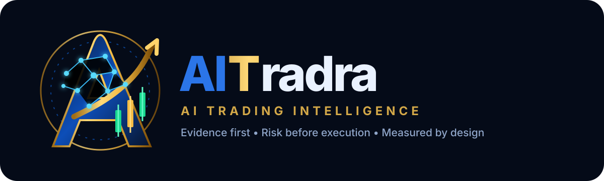
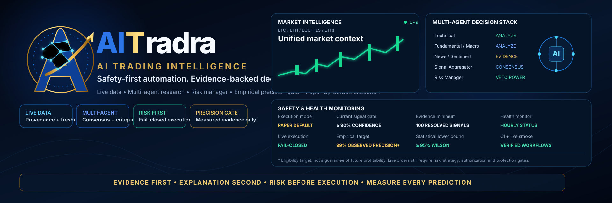
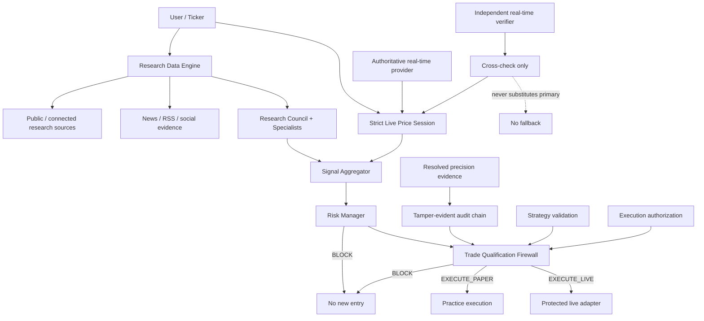

<div align="center">



# AITradra

### Evidence-first AI market intelligence with fail-closed trading automation

**Real evidence → Multi-agent research → Signal → Risk veto → Empirical validation → Protected execution**

[](https://github.com/logeshv586-code/AITradra/actions/workflows/safety-ci.yml)
[](https://github.com/logeshv586-code/AITradra/actions/workflows/live-system-smoke.yml)


[Product](#product) · [Architecture](#architecture) · [Real-time data contract](#strict-real-time-data-contract) · [Safety](#trading-safety) · [Precision](#empirical-precision-gate) · [Health](#operations--health-evidence) · [Quick start](#quick-start) · [Contribute](#community)

</div>

<p align="center">
  
</p>

> [!IMPORTANT]
> **AITradra does not guarantee profit, investment returns, or 99% future trade accuracy.** A configured precision target is an execution-eligibility threshold based on measured historical outcomes, not a promise about future trades. Paper trading is the safe default and funded execution is fail-closed.

---

## Product

AITradra is an open-source **AI-native market intelligence and trading engineering platform** for source-aware research, multi-agent analysis, prediction measurement, portfolio/risk controls, paper trading and explicitly gated live execution.

The core design principle is simple:

> **Research can inform a decision, but only measured data quality, deterministic risk controls and explicit execution gates can authorize an order.**

### What the platform provides

| Capability | Purpose |
|---|---|
| Market intelligence | Price action, context, provenance and freshness |
| Multi-agent research | Technical, fundamental, macro, sentiment, sector and catalyst views |
| News evidence | Source-aware recent headlines and market context |
| Prediction tracking | Direction, confidence, timestamp and later measured outcome |
| Risk Manager | Deterministic veto before a new entry can qualify |
| Empirical precision gate | Uses resolved outcomes and statistical bounds, not displayed confidence alone |
| Paper trading | Practice fills with adverse slippage, fees and persistent positions |
| Manual live path | Separately authorized Hyperliquid-focused execution |
| Autonomous path | Separately gated by signal, risk, strategy, precision and authorization |
| Health evidence | Safety CI, frontend build, recurring live-network smoke and exact-SHA ledger |

---

## Why AITradra is different

AITradra deliberately separates concerns that are often mixed together in trading prototypes:

- **research data** vs **decision-grade live price data**;
- **agent confidence** vs **measured empirical precision**;
- **research quality** vs **execution permission**;
- **paper execution** vs **funded execution**;
- **manual live permission** vs **autonomous live permission**;
- **primary execution price** vs **independent validation price**;
- **historical evidence** vs **fresh execution-time evidence**.

This separation makes failure visible and allows the system to block instead of silently substituting weaker data.

---

## Architecture



### Boundary ownership

| Layer | Responsibility |
|---|---|
| Research | Collect and explain evidence; never grants execution authority |
| Strict live price | Produce fresh decision-grade price provenance or fail closed |
| Signal Aggregator | Convert specialist evidence into current BUY/SELL/HOLD state |
| Risk Manager | Deterministic capital/risk veto |
| Precision store | Preserve resolved directional evidence eligible for live gating |
| Precision audit | Detect edits, deletions or unaudited evidence rows |
| Qualification firewall | Single pre-order permission boundary |
| Execution adapter | May submit only after qualification says execution is allowed |

See [`docs/RESEARCH_EXECUTION_BOUNDARY.md`](docs/RESEARCH_EXECUTION_BOUNDARY.md) for the full contract.

---

## Strict real-time data contract

AITradra now has a dedicated **decision-grade live-price path** in `gateway/live_price_session.py`.

### No execution-provider fallback

For qualification-sensitive price use:

1. The **first enabled market-data connection** is the authoritative provider.
2. Its observation may be reused only inside a short validity window.
3. After expiry, AITradra must fetch a new observation from that same provider.
4. If the authoritative provider fails, AITradra **blocks** instead of switching to another provider.
5. Historical SQLite data, stale cache and research-source fallbacks are not promoted to decision-grade data.

Default validity:

```env
LIVE_PRICE_VALIDITY_SECONDS=120
```

Allowed range is clamped by code to 5–900 seconds.

### Independent verification without fallback

By default, a second independently configured live provider is required to validate the primary price:

```env
LIVE_PRICE_REQUIRE_CROSSCHECK=true
LIVE_PRICE_MAX_CROSSCHECK_DIFF_PCT=1.0
```

The verifier is **not a backup execution source**. It only validates the primary quote.

The decision path blocks when:

- no live provider is configured;
- the primary provider fails;
- the primary returns an unusable price;
- cross-checking is required but no independent verifier exists;
- the verifier fails;
- the providers disagree beyond the configured threshold;
- the previously validated observation has expired and cannot be refreshed.

Accepted observations include provenance such as:

- `source_used`
- `connection_id`
- `observed_at`
- `expires_at`
- `freshness_seconds`
- `validity_seconds`
- `decision_grade=true`
- `fallback_used=false`
- independent cross-check metadata

> [!NOTE]
> The broader Research Data Engine may still use public sources and clearly labelled historical/cache data for research and display. That is intentionally separate from the strict execution-grade price contract.

---

## Multi-agent intelligence

The research stack can include:

- Technical Specialist
- Fundamental Specialist
- Macro Specialist
- Sentiment Specialist
- Sector Specialist
- Catalyst Specialist
- Breakout / Momentum analysis
- Regime Detector
- Signal Aggregator
- Risk Manager
- Critique / Reflection
- Optional FinBERT, Quantic and swarm-style validation layers

Research outputs remain advisory. A persuasive agent debate or high research score cannot bypass Risk Manager or the qualification firewall.

---

## Trading safety

### Safe defaults

```env
PAPER_TRADE_MODE=true
AUTOTRADE_ENABLED=false
MANUAL_LIVE_TRADING_ENABLED=false
REQUIRE_PROTECTIVE_ORDERS=true
REQUIRE_STRATEGY_VALIDATION=true
REQUIRE_EMPIRICAL_PRECISION_VALIDATION=true
```

### Important controls

- Paper trading by default
- Separate manual-live and autonomous-live permissions
- Explicit live acknowledgement
- Position-size limits
- Daily-loss breaker
- Cash reserve requirement
- Maximum open positions
- Leverage cap
- Stop-loss / take-profit geometry validation
- Protective-order enforcement
- Reduce-only close support
- Existing-position add-ons disabled by default
- Fresh strategy validation for autonomous live entries
- Current-signal confidence threshold
- Empirical precision threshold
- Tamper-evident precision evidence audit
- Decision-grade live-price freshness gate
- Independent live-price disagreement gate
- Secret scanning in Safety CI

Manual and autonomous live permissions are independent. Adding broker credentials does **not** silently enable autonomous trading.

Current customer-connected funded execution is **Hyperliquid-focused**; the repository should not be represented as direct funded equity-broker execution.

---

## Empirical precision gate

Displayed model confidence is not treated as measured accuracy.

Default autonomous-live evidence settings:

```env
AUTOTRADE_TARGET_PRECISION=0.99
AUTOTRADE_MIN_SIGNAL_CONFIDENCE=90.0
AUTOTRADE_MIN_EVALUATED_SIGNALS=100
AUTOTRADE_MIN_PRECISION_LOWER_BOUND=0.95
PRECISION_LOOKBACK_DAYS=90
PRECISION_VALIDATION_MAX_AGE_DAYS=30
```

A new autonomous live entry requires, among other controls:

1. an actionable non-HOLD signal;
2. Risk Manager `APPROVE`;
3. valid protective levels;
4. live execution authorization;
5. current signal confidence above the configured live minimum;
6. approved/fresh strategy validation;
7. enough resolved directional observations;
8. observed precision at or above the configured target;
9. a Wilson lower bound at or above the configured threshold;
10. recent precision evidence;
11. a valid tamper-evident audit chain.

The precision store is append-only through the application API and rejects evidence with invalid chronology or blocked/stale provenance. Accepted rows are chained by SHA-256 audit hashes; the gate fails closed if evidence is edited, deleted or inserted outside the audit chain.

> [!WARNING]
> A 99% configured target is deliberately difficult. Even historical evidence that satisfies the gate does not guarantee future accuracy, positive P&L, or protection from slippage, fees, gaps, latency or regime change.

---

## Operations & health evidence

AITradra uses **measured workflow evidence**, not a hard-coded README claim, to show health.

### Safety CI

`.github/workflows/safety-ci.yml` runs on pushes to `main`, pull requests and manual dispatch. It verifies:

- critical Python compilation;
- secret scanning;
- trading-safety regressions;
- strict live-price tests;
- precision gate and precision-audit tests;
- customer/live-integrity regressions;
- production React build.

It publishes exact-SHA artifacts for both the backend safety suite and frontend build.

### Live System Smoke

`.github/workflows/live-system-smoke.yml` runs:

- on pushes to `main`;
- on pull requests;
- every four hours;
- on manual dispatch.

It verifies real public-network market collection, agent consumption, practice-trade mechanics, news/social provenance, autonomous-decision guards and the strict decision-grade boundary tests.

The smoke workflow always forces:

```env
PAPER_TRADE_MODE=true
AUTOTRADE_ENABLED=false
MANUAL_LIVE_TRADING_ENABLED=false
```

Therefore the smoke workflow itself does **not** submit a funded live trade.

### Exact-SHA health ledger

Both workflows append their measured conclusion to:

**[Issue #41 — automated CI and live-smoke health ledger](https://github.com/logeshv586-code/AITradra/issues/41)**

Each ledger entry records:

- workflow name;
- exact tested SHA;
- ref/event;
- job conclusions;
- run URL;
- funded-execution state for live smoke.

This provides an external monitoring surface even when a client cannot enumerate push-triggered GitHub Actions runs through the Checks API.

> **Status rule:** a missing run is never converted to PASS. Use the dynamic workflow badges, GitHub Actions run and health-ledger entry for measured status. “Implemented” and “measured PASS” are different claims.

---

## Practice trading

Practice mode models:

- reference market prices when available;
- adverse slippage;
- fees;
- cash and positions;
- realized/unrealized P&L;
- protective exits;
- persistent practice state.

Defaults:

```env
PAPER_STARTING_BALANCE=100000
PAPER_SLIPPAGE_BPS=5
PAPER_FEE_BPS=4
```

Paper results are evidence about the simulation assumptions used; they are not guaranteed live results.

---

## Quick start

### Requirements

- Python 3.12+
- Node.js 22+
- Git

### 1. Clone

```bash
git clone https://github.com/logeshv586-code/AITradra.git
cd AITradra
cp .env.example .env
```

Keep the safe execution defaults unless you intentionally configure and validate a live environment:

```env
PAPER_TRADE_MODE=true
AUTOTRADE_ENABLED=false
MANUAL_LIVE_TRADING_ENABLED=false
```

### 2. Backend

```bash
python -m venv venv
```

Linux/macOS:

```bash
source venv/bin/activate
```

Windows PowerShell:

```powershell
.\venv\Scripts\Activate.ps1
```

Install and run:

```bash
pip install -r requirements.txt
python main.py
```

### 3. Frontend

```bash
cd ui
npm ci
npm run dev
```

Production build:

```bash
npm run build
```

### 4. Decision-grade live data

Research/public-data features can operate independently, but qualification-sensitive agents using the strict live-price session require configured market-data connections.

For the default independent cross-check policy, configure **two independent live market-data connections** in the application. The first is authoritative; the second validates it and is never used as fallback.

---

## Testing

Focused safety suite:

```bash
python -m pytest -q \
  tests/test_trading_safety.py \
  tests/test_precision_gate.py \
  tests/test_precision_audit.py \
  tests/test_strict_live_price_session.py \
  tests/test_self_improvement.py \
  tests/test_customer_experience.py \
  tests/test_live_integrity.py
```

Frontend:

```bash
cd ui
npm ci
npm run build
```

Live-network smoke is intentionally paper-only:

```bash
python scripts/live_system_smoke.py
python scripts/live_news_decision_smoke.py
```

---

## Project structure

```text
AITradra/
├── agents/                    # Specialist, data, signal and risk agents
├── brokers/                   # Practice + protected execution adapters
├── core/                      # Config, safety, statistics, qualification, precision gate
├── gateway/                   # API, research data engine, strict live-price session
├── self_improvement/          # Outcome scoring, precision store and audit chain
├── tests/                     # Safety, data integrity, precision and customer regressions
├── ui/                        # React + Vite customer application
├── scripts/                   # Live smoke and evidence utilities
├── docs/                      # Architecture, development and investor material
└── .github/workflows/         # Safety CI, research-quality CI, live-system smoke
```

---

## Safety position

| Area | Repository policy |
|---|---|
| Research-source provenance | Source/freshness metadata preserved |
| Decision-grade live price | Strict connected provider path |
| Execution-provider fallback | **Disabled** |
| Independent price verification | Cross-check only; never substitutes primary |
| Stale/cache execution substitution | **Blocked** |
| Risk Manager veto | Enforced before qualification |
| Protective orders | Required by default |
| Empirical precision gate | Required by default for autonomous live entries |
| Precision evidence integrity | Tamper-evident audit chain |
| Practice execution | Default |
| Autonomous funded execution | Disabled by default |
| Manual funded execution | Disabled by default |
| CI / smoke funded order submission | **No** |
| Guaranteed profitability | **No** |
| Guaranteed future 99% accuracy | **No** |

Measured CI/smoke status should be read from the workflow badges, run pages and [health ledger](https://github.com/logeshv586-code/AITradra/issues/41), not inferred from this table.

---

## Community

- [Contributing guide](CONTRIBUTING.md)
- [Roadmap](ROADMAP.md)
- [Development guide](docs/DEVELOPMENT.md)
- [Security policy](SECURITY.md)
- [Code of Conduct](CODE_OF_CONDUCT.md)
- [Research → Qualification → Execution boundary](docs/RESEARCH_EXECUTION_BOUNDARY.md)

Good-first and help-wanted tasks are tracked in GitHub Issues.

---

## Investor / evidence policy

AITradra should be evaluated through reproducible evidence:

- exact-source market observations;
- forward prediction outcomes;
- blocked decisions as well as executed paper decisions;
- fees/slippage-aware paper results;
- statistical precision bounds;
- CI/smoke artifacts tied to exact SHAs;
- clear separation between research, simulation and funded execution.

Backtests, research scores, paper results and historical precision do **not** guarantee future profitability.

---

## License

[MIT License](LICENSE)

---

<div align="center">

**Build evidence. Measure outcomes. Block unsafe execution.**

</div>
