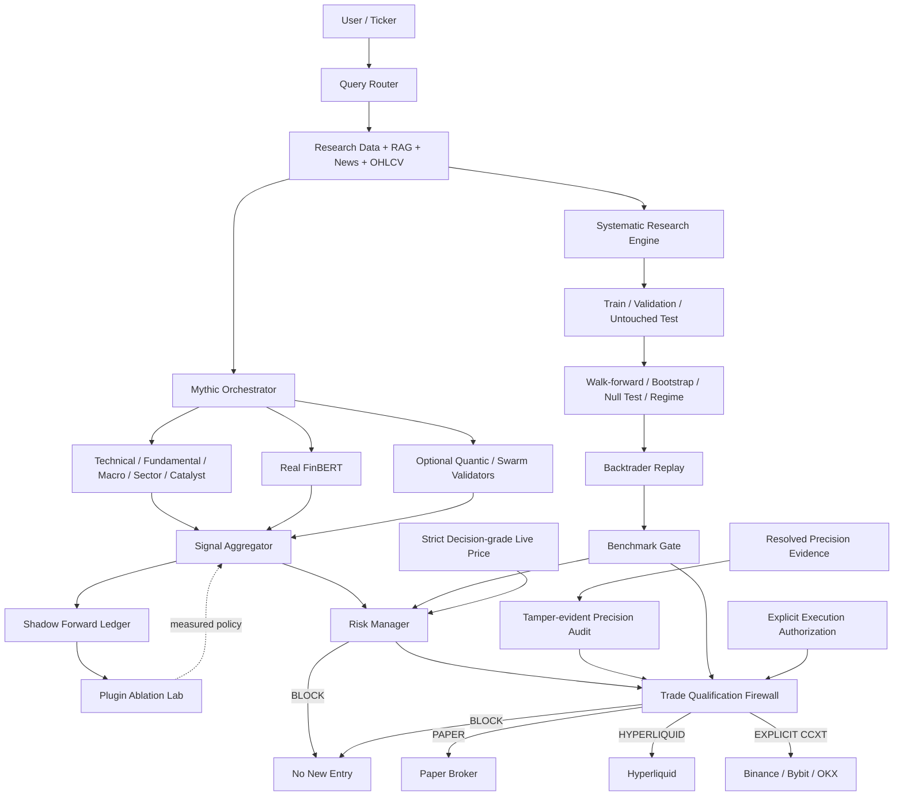

<div align="center">


# AITradra

### Evidence-first AI market intelligence, systematic research and fail-closed trading automation

**Market evidence → Mythic multi-agent research → Systematic validation → Plugin ablation → Risk veto → Empirical precision → Protected execution**

[](https://github.com/logeshv586-code/AITradra/actions/workflows/safety-ci.yml)
[](https://github.com/logeshv586-code/AITradra/actions/workflows/live-system-smoke.yml)


[Product](#product) · [Architecture](#architecture) · [Systematic Research](#systematic-strategy-research) · [Plugin Accuracy](#plugin-accuracy--ablation) · [Benchmark Gate](#beat-the-benchmark-gate) · [Safety](#trading-safety) · [Quick Start](#quick-start)

</div>

<p align="center">
  
</p>

> [!IMPORTANT]
> **AITradra does not guarantee profit, investment returns, benchmark outperformance or any future accuracy percentage.** All accuracy, precision, backtest and benchmark figures are evidence measurements under specific historical or paper conditions. Paper trading is the safe default and funded execution remains fail-closed.

---

## Product

AITradra is an open-source **AI-native market intelligence and trading engineering platform** designed to answer a harder question than “what does the AI think?”:

> **Does the strategy, model or plugin add measurable out-of-sample value after costs, risk controls and benchmark comparison?**

The platform combines source-aware market research, one authoritative multi-agent decision pipeline, systematic strategy discovery, independent event-driven validation, real FinBERT sentiment, portfolio optimization, forward shadow evidence and strict execution qualification.

### Core capabilities

| Capability | Purpose |
|---|---|
| Market intelligence | Price action, OHLCV, news, macro and source provenance |
| Mythic multi-agent research | Technical, fundamental, macro, sentiment, sector, catalyst and risk reasoning |
| Real FinBERT | `ProsusAI/finbert` financial-news sentiment classification |
| Systematic strategy engine | Momentum, SMA trend, mean reversion and breakout candidate discovery |
| Statistical robustness | Train/validation/test, walk-forward, bootstrap, null tests, multiple-testing adjustment and regime stability |
| Backtrader replay | Independent event-driven replay with fees, slippage and long/short/exit transitions |
| Beat-the-benchmark gate | Requires OOS performance relative to SPY, NIFTY 50 or BTC depending on market |
| Plugin Ablation Lab | Measures whether optional plugins improve hit rate or probability calibration |
| Shadow paper ledger | Tamper-evident forward decision evidence without execution authority |
| Portfolio optimization | Half-Kelly, volatility controls and PyPortfolioOpt HRP for multi-asset allocation |
| Empirical precision gate | Uses resolved directional outcomes and Wilson statistical bounds |
| Risk Manager | Deterministic pre-order veto and sizing constraints |
| Strict live-price contract | Primary real-time source plus independent verifier; no provider fallback |
| Protected broker routing | Paper, Hyperliquid and explicit CCXT venue routing |
| Health evidence | Safety CI, frontend build, smoke checks and exact-SHA health ledger |

---

## What changed in the trading-accuracy upgrade

The current `main` branch removes several sources of false confidence that commonly appear in AI trading systems.

- **FinBERT is now actually FinBERT.** The sentiment agent runs `ProsusAI/finbert`; it does not silently replace the model with a general LLM while continuing to call the output FinBERT.
- **Vibe strategy backtests must contain measured metrics.** Empty or zero-only output cannot be classified as a successful validation result.
- **Vibe Swarm no longer receives a fixed predictive confidence.** Successful plugin execution is not treated as proof of market accuracy.
- **Optional plugins must earn positive influence.** FinBERT, Quantic and Swarm outputs are measured through forward ablation before they can receive positive weighting.
- **Quantic disagreement can reduce risk before it earns positive weight.** This keeps external validation asymmetric and conservative.
- **PyPortfolioOpt is genuinely active.** HRP is used when multi-asset histories are supplied, while central per-position safety caps remain enforced.
- **CCXT routing is explicit and fail-closed.** A configured venue is selected deliberately; the system does not silently redirect a funded order to another broker.
- **The old competing legacy decision chain is retired.** Legacy orchestration is now compatibility-only and routes analysis into the authoritative Mythic pipeline.
- **Core vectorized research uses NumPy/Pandas.** Backtrader remains the independent event-driven validator; AITradra does not claim `vectorbt` is powering core research when it is not.

---

## Architecture

AITradra now has one authoritative research-to-decision direction:



### Execution authority boundaries

| Layer | Can research? | Can influence confidence? | Can authorize funded execution? |
|---|---:|---:|---:|
| Research specialists | Yes | Yes | No |
| FinBERT | Yes | Only after measured ablation policy | No |
| Quantic / Swarm | Yes | Only under measured policy; disagreement may reduce | No |
| Systematic Research Engine | Yes | Produces strategy evidence | No |
| Backtrader validation | Yes | Produces deployment evidence | No |
| Benchmark scorecard | Yes | Can block strategy eligibility | No |
| Shadow ledger | Yes | Supplies forward evidence | No |
| Risk Manager | No | N/A | Can veto only |
| Precision gate | No | N/A | Can block only |
| Qualification firewall | No | N/A | Final permission boundary |
| Broker adapter | No | No | Executes only after permission |

See [`docs/RESEARCH_EXECUTION_BOUNDARY.md`](docs/RESEARCH_EXECUTION_BOUNDARY.md) for the detailed contract.

---

## Systematic strategy research

`core/systematic_research.py` performs lightweight deterministic candidate discovery before event-driven replay.

### Strategy families

Current catalog includes:

- **Momentum** — multiple lookback and threshold combinations
- **SMA crossover** — fast/slow trend combinations
- **Mean reversion** — rolling z-score entry configurations
- **Breakout** — multiple breakout windows

### Validation sequence

Candidate discovery is deliberately separated from final validation:

1. **60% training window** — screen candidate strategies.
2. **20% validation window** — rank top candidates without touching the final test window.
3. **20% untouched test window** — challenge the selected winner.
4. **Walk-forward stability** — require acceptable performance across sequential periods.
5. **Block bootstrap** — estimate Sharpe robustness under resampled return blocks.
6. **Sign-flip null test** — challenge whether observed positive performance could be random directional noise.
7. **Multiple-testing adjustment** — penalize strategy selection across many candidate trials.
8. **Regime stability** — examine performance across trend and volatility regimes.
9. **Composite robustness score** — combine independent robustness evidence.
10. **Backtrader replay** — independently replay dated BUY / SELL / EXIT transitions with trading friction.
11. **Benchmark comparison** — compare OOS performance against the relevant market benchmark.

Default systematic settings are configurable through `.env`:

```env
SYSTEMATIC_RESEARCH_ENABLED=true
SYSTEMATIC_RESEARCH_MIN_HISTORY=260
SYSTEMATIC_RESEARCH_MAX_CANDIDATES=40
SYSTEMATIC_RESEARCH_TOP_K=5
SYSTEMATIC_RESEARCH_MIN_ROBUSTNESS_SCORE=60
SYSTEMATIC_RESEARCH_MIN_TEST_SHARPE=0.25
SYSTEMATIC_RESEARCH_MAX_TEST_DRAWDOWN_PCT=25
SYSTEMATIC_RESEARCH_MIN_TRIAL_ADJUSTED_PROBABILITY=0.70
SYSTEMATIC_RESEARCH_MAX_SIGNFLIP_P_VALUE=0.20
SYSTEMATIC_BOOTSTRAP_SAMPLES=400
SYSTEMATIC_SIGNFLIP_SAMPLES=400
```

> [!NOTE]
> A strategy passing systematic research is **eligible for further qualification**, not guaranteed profitable and not automatically authorized for a funded order.

---

## Beat-the-benchmark gate

A strategy is no longer considered deployable merely because its isolated backtest is profitable.

The event-driven out-of-sample period is compared against a broad default benchmark:

| Traded market | Default benchmark |
|---|---|
| US / general equities | `SPY` |
| Indian NSE symbols ending in `.NS` | `^NSEI` — NIFTY 50 |
| Crypto | `BTC-USD` |

For `DEPLOY` eligibility, the strategy must satisfy the existing full-sample and OOS validation gates **and** pass the benchmark scorecard criteria, including:

- higher OOS total return;
- higher OOS Sharpe ratio;
- drawdown not materially worse than the benchmark, with a small absolute tolerance for near-flat benchmarks.

The benchmark scorecard can also calculate:

- active return;
- annualized alpha;
- beta;
- information ratio;
- directional hit rate;
- Brier score when probability forecasts are available;
- regime-level strategy vs benchmark performance.

Benchmark results are historical/paper evidence only and are not a promise of future outperformance.

---

## Plugin accuracy & ablation

`self_improvement/plugin_ablation.py` answers a critical question:

> **Did this plugin improve the decision compared with the same core system without it?**

The lab evaluates optional plugin output against resolved shadow decisions using the same underlying outcomes.

### Plugin policies

| Policy | Meaning |
|---|---|
| `KEEP` | Sufficient forward evidence shows incremental value |
| `ADVISORY` | Insufficient or inconclusive evidence; no positive confidence credit |
| `DISABLE` | Measured evidence shows material calibration regression without directional benefit |

Primary metrics:

- directional hit-rate delta;
- core Brier score;
- plugin-blended Brier score;
- probability calibration improvement;
- resolved sample count.

By default a plugin needs a meaningful number of resolved samples before it can move from `ADVISORY` to positive influence.

### Current behavior

- **FinBERT**: actual financial sentiment model; positive influence only after measured ablation evidence.
- **Quantic / SMC**: unproven agreement does not automatically boost confidence; meaningful disagreement may reduce confidence as a conservative veto.
- **Vibe Swarm**: advisory synthesis; successful execution does not manufacture predictive confidence.

This design makes plugin count irrelevant. Only measured incremental contribution matters.

---

## Real FinBERT sentiment

`agents/sentiment_classifier.py` loads:

```text
ProsusAI/finbert
```

The model processes financial headlines and aggregates positive, negative and neutral probabilities into a bounded sentiment score and confidence value.

Important behavior:

- lazy model initialization;
- CUDA is used when available;
- CPU fallback is supported;
- model failure returns neutral/unverified evidence rather than silently switching model identity;
- the output records the verified model name;
- positive trading influence is still governed by forward plugin ablation.

FinBERT therefore provides a real domain-specific sentiment source without being treated as automatic alpha.

---

## Shadow forward evidence

`self_improvement/shadow_trade_store.py` records actionable decisions before they have permission to become funded trades.

Each shadow decision stores:

- ticker;
- direction;
- confidence;
- entry price;
- strategy identifier;
- evaluation horizon;
- core probability snapshot;
- plugin snapshot;
- evidence metadata;
- timestamp;
- SHA-256 chained row hash.

Later, `self_improvement/shadow_resolver.py` resolves due decisions using market prices and appends outcome evidence.

The original prediction row is not rewritten. This allows AITradra to measure:

- forward directional hit rate;
- average directional return;
- plugin incremental contribution;
- calibration quality;
- tamper-evident evidence-chain validity.

Shadow evidence has:

```text
execution_authority = false
```

It exists to improve measurement, not to bypass trading controls.

---

## Portfolio optimization

The Portfolio Agent keeps central risk limits authoritative while supporting two levels of sizing.

### Single asset

Uses:

- Half-Kelly sizing;
- historical win/loss ratio;
- annualized volatility sizing;
- configured central `MAX_POSITION_PCT` cap.

### Multi asset

When `asset_price_history` is supplied, AITradra attempts **PyPortfolioOpt Hierarchical Risk Parity (HRP)**.

The resulting weights are then constrained by the same central per-asset cap. If HRP cannot run, the system uses a bounded inverse-volatility fallback rather than inventing weights.

Portfolio optimization improves allocation and diversification engineering; it does not create predictive edge by itself.

---

## Authoritative multi-agent pipeline

AITradra previously contained both a legacy 14-agent LangGraph chain and the newer Mythic orchestration path. That could allow different endpoints to produce different decision processes.

The current architecture makes **MythicOrchestrator authoritative**.

The legacy `AgentOrchestrator` remains only as a compatibility facade for older callers and routes analysis into the same Mythic research path.

Current direction:

```text
QueryRouter
   ↓
Data / RAG / News / Intelligence Snapshot
   ↓
MythicOrchestrator
   ↓
Specialists + Critique + Optional Validators
   ↓
SignalAggregator
   ↓
Risk / Research / Benchmark / Precision Qualification
```

QUICK, DEEP and INSTITUTIONAL research modes therefore share one authoritative decision architecture instead of competing legacy conclusions.

---

## Strict real-time data contract

Qualification-sensitive pricing is handled by `gateway/live_price_session.py`.

### No execution-provider fallback

1. The **first enabled real-time market-data connection** is the authoritative provider.
2. Its observation is valid only inside the configured freshness window.
3. After expiry, the same authoritative provider must provide a fresh observation.
4. If the authoritative provider fails, AITradra **blocks** instead of silently switching providers.
5. Historical SQLite data, stale cache and research-source fallbacks cannot become decision-grade execution prices.

Default validity:

```env
LIVE_PRICE_VALIDITY_SECONDS=120
LIVE_PRICE_REQUIRE_CROSSCHECK=true
LIVE_PRICE_MAX_CROSSCHECK_DIFF_PCT=1.0
```

A second independently configured provider is used only to validate the primary quote. It is never promoted into a fallback execution source.

The decision path blocks when the primary price is missing, stale, unusable, unverifiable or materially inconsistent with its independent cross-check.

---

## Trading safety

### Safe defaults

```env
PAPER_TRADE_MODE=true
AUTOTRADE_ENABLED=false
MANUAL_LIVE_TRADING_ENABLED=false
REQUIRE_PROTECTIVE_ORDERS=true
REQUIRE_STRATEGY_VALIDATION=true
REQUIRE_EMPIRICAL_PRECISION_VALIDATION=true
```

### Main controls

- paper trading by default;
- separate manual-live and autonomous-live permissions;
- explicit live acknowledgement;
- central position-size limits;
- daily-loss breaker;
- cash reserve requirement;
- maximum open-position control;
- leverage cap;
- stop-loss / take-profit geometry validation;
- protective-order enforcement;
- reduce-only close support;
- existing-position add-ons disabled by default;
- systematic + Backtrader strategy validation;
- out-of-sample benchmark gate;
- current-signal confidence threshold;
- empirical precision threshold;
- tamper-evident precision audit;
- strict live-price freshness gate;
- independent live-price disagreement gate;
- explicit broker selection;
- secret scanning in Safety CI.

Adding credentials does **not** enable autonomous funded trading.

---

## Broker routing

### Paper broker

The default execution route. It requires a market reference price and models:

- adverse slippage;
- trading fees;
- cash balance;
- long equity-style positions;
- persistent trade records in the broader practice system.

### Hyperliquid

The primary specialized crypto execution integration. Live signing remains behind explicit execution authorization.

### CCXT

AITradra includes explicit CCXT routing for configured exchanges such as:

- Binance;
- Bybit;
- OKX.

A CCXT venue must be explicitly configured. The router does not silently substitute another funded broker if that venue is unavailable.

---

## Empirical precision gate

Displayed model confidence is not treated as measured accuracy.

Default autonomous-live evidence settings include:

```env
AUTOTRADE_TARGET_PRECISION=0.99
AUTOTRADE_MIN_SIGNAL_CONFIDENCE=90.0
AUTOTRADE_MIN_EVALUATED_SIGNALS=100
AUTOTRADE_MIN_PRECISION_LOWER_BOUND=0.95
PRECISION_LOOKBACK_DAYS=90
PRECISION_VALIDATION_MAX_AGE_DAYS=30
```

A new autonomous live entry requires, among other controls:

1. an actionable non-HOLD signal;
2. Risk Manager approval;
3. valid protective levels;
4. explicit live authorization;
5. current signal confidence above the configured minimum;
6. approved and fresh strategy validation;
7. successful benchmark-relative validation where applicable;
8. enough resolved directional observations;
9. observed precision at or above the configured target;
10. Wilson lower-bound evidence at or above the configured threshold;
11. recent evidence;
12. a valid tamper-evident precision chain.

> [!WARNING]
> A configured 99% target is an intentionally strict eligibility condition. It is **not** a statement that AITradra is currently or will be 99% accurate.

---

## Practice trading

Practice mode models:

- real/reference market prices when available;
- adverse slippage;
- fees;
- cash and positions;
- realized and unrealized P&L;
- protective exits;
- persistent practice state.

Defaults:

```env
PAPER_STARTING_BALANCE=100000
PAPER_SLIPPAGE_BPS=5
PAPER_FEE_BPS=4
```

Paper performance depends on the assumptions used and is not guaranteed to match funded trading.

---

## Operations & health evidence

AITradra uses measured workflow status rather than static “all systems green” documentation claims.

### Safety CI

`.github/workflows/safety-ci.yml` runs on pushes to `main`, pull requests and manual dispatch.

It currently verifies:

- critical Python compilation;
- embedded-secret checks;
- data-validation regressions;
- primary-source retry behavior;
- trading-safety controls;
- empirical precision and precision-audit logic;
- strict live-price session behavior;
- self-improvement evidence handling;
- customer/live-integrity regressions;
- systematic research regressions;
- portfolio risk-cap behavior;
- FinBERT/Vibe/plugin-accuracy regressions;
- shadow ledger and benchmark scorecard regressions;
- broker-routing regressions;
- production React build.

The workflow records the **exact tested SHA in the GitHub job summary**. Artifact uploads are deliberately disabled to avoid unnecessary Actions storage use.

### Live System Smoke

The live-system smoke workflow exercises public-network and application paths while forcing safe execution settings:

```env
PAPER_TRADE_MODE=true
AUTOTRADE_ENABLED=false
MANUAL_LIVE_TRADING_ENABLED=false
```

It does not submit funded trades.

### Health ledger

Workflow outcomes are also published into:

**[Issue #41 — automated CI and live-smoke health ledger](https://github.com/logeshv586-code/AITradra/issues/41)**

Use the workflow badges, GitHub Actions run and exact-SHA ledger entry as the measured source of truth.

---

## Quick start

### Requirements

- Python 3.12+
- Node.js 22+
- Git

### 1. Clone

```bash
git clone https://github.com/logeshv586-code/AITradra.git
cd AITradra
cp .env.example .env
```

Keep the safe defaults unless you are intentionally validating a controlled live environment:

```env
PAPER_TRADE_MODE=true
AUTOTRADE_ENABLED=false
MANUAL_LIVE_TRADING_ENABLED=false
```

### 2. Backend

```bash
python -m venv venv
```

Linux/macOS:

```bash
source venv/bin/activate
```

Windows PowerShell:

```powershell
.\venv\Scripts\Activate.ps1
```

Install dependencies and start:

```bash
pip install -r requirements.txt
python main.py
```

> [!NOTE]
> The FinBERT model is loaded lazily the first time sentiment classification is required. Initial model loading can require additional memory and download time.

### 3. Frontend

```bash
cd ui
npm ci
npm run dev
```

Production build:

```bash
npm run build
```

### 4. Decision-grade live market data

Research/public-data functionality can run separately. Qualification-sensitive live trading requires configured decision-grade real-time market-data connections.

For the default cross-check policy, configure two independent providers: the first is authoritative and the second verifies it.

---

## Testing

Focused safety and trading-accuracy suite:

```bash
python -m pytest -q \
  tests/test_data_validation.py \
  tests/test_primary_source_retry.py \
  tests/test_trading_safety.py \
  tests/test_precision_gate.py \
  tests/test_precision_audit.py \
  tests/test_strict_live_price_session.py \
  tests/test_self_improvement.py \
  tests/test_customer_experience.py \
  tests/test_live_integrity.py \
  tests/test_systematic_research.py \
  tests/test_portfolio_risk_cap.py \
  tests/test_trading_plugin_accuracy.py \
  tests/test_shadow_benchmark_portfolio.py \
  tests/test_broker_routing_accuracy.py
```

Frontend:

```bash
cd ui
npm ci
npm run build
```

---

## Project structure

```text
AITradra/
├── agents/
│   ├── orchestrator.py                 # Authoritative Mythic research orchestration
│   ├── query_router.py                 # Research-mode and ticker routing
│   ├── sentiment_classifier.py         # Real ProsusAI/finbert sentiment
│   ├── signal_aggregator.py            # Evidence-aware signal fusion
│   ├── strategy_generator_agent.py     # Vibe strategy generation + metric validation
│   └── legacy/                         # Compatibility agents; legacy orchestration redirects to Mythic
├── brokers/
│   ├── broker_router.py                # Explicit paper / Hyperliquid / CCXT routing
│   └── hyperliquid_broker.py
├── core/
│   ├── systematic_research.py          # Candidate discovery and statistical robustness
│   ├── portfolio_optimizer.py          # HRP + bounded fallback allocation
│   ├── trading_safety.py               # Strategy evidence and qualification support
│   └── config.py                       # Central safety and research configuration
├── gateway/
│   ├── server.py
│   ├── live_price_session.py           # Strict decision-grade price contract
│   └── knowledge_store.py
├── self_improvement/
│   ├── plugin_ablation.py              # KEEP / ADVISORY / DISABLE plugin measurement
│   ├── shadow_trade_store.py           # Tamper-evident forward decision ledger
│   ├── shadow_resolver.py              # Later-price outcome resolution
│   ├── benchmark_scorecard.py          # Strategy vs benchmark evaluation
│   ├── precision_store.py
│   └── engine.py
├── tests/                              # Safety, accuracy, benchmark and routing regressions
├── ui/                                 # React + Vite application
├── scripts/                            # Smoke and evidence utilities
├── docs/                               # Architecture and design documentation
└── .github/workflows/                  # Safety CI and live-system validation
```

---

## Safety position

| Area | Repository policy |
|---|---|
| Research-source provenance | Preserved and separated from execution pricing |
| Systematic candidate selection | Train/validation/untouched-test separation |
| Backtest realism | Independent Backtrader replay with fees and slippage |
| Benchmark comparison | Required for current strategy deployment eligibility |
| Optional plugin confidence | Must be earned through measured forward ablation |
| Shadow evidence | Tamper-evident and non-executing |
| Decision-grade live price | Strict primary provider path |
| Execution-provider fallback | **Disabled** |
| Independent price verification | Validation only; never substitutes primary |
| Stale/cache execution substitution | **Blocked** |
| Portfolio sizing | Central cap remains authoritative |
| Risk Manager veto | Enforced before qualification |
| Protective orders | Required by default |
| Empirical precision | Required by default for autonomous live entries |
| Practice execution | Default |
| Autonomous funded execution | Disabled by default |
| Manual funded execution | Disabled by default |

---

## What AITradra does **not** claim

AITradra does not claim that:

- more agents automatically increase accuracy;
- more plugins automatically increase accuracy;
- FinBERT guarantees better returns;
- a backtest proves future profitability;
- an AI confidence score equals a measured win rate;
- passing a benchmark historically guarantees future alpha;
- a 99% configured precision threshold means the system currently achieves 99% accuracy;
- paper fills reproduce all live market conditions.

The platform is designed to **measure, reject and audit** these assumptions instead of hiding them.

---

## Roadmap

Current next-stage research directions include:

- larger cross-sectional and multi-asset strategy families;
- nested walk-forward re-optimization;
- richer factor and statistical-arbitrage research;
- liquidity and turnover-aware portfolio optimization;
- broader benchmark families;
- long-horizon shadow evidence dashboards;
- automatic plugin policy visualization;
- deeper calibration analysis by market regime;
- Strategy Lab UI for systematic robustness and benchmark evidence.

New strategies and plugins should enter as **research candidates first**, then earn influence through measured evidence.

---

## Community

Contributions are welcome when they preserve the core principles of:

1. **No fake data.**
2. **No silent execution fallback.**
3. **No confidence presented as empirical accuracy.**
4. **No research component granting itself trading permission.**
5. **No plugin receives positive weight without evidence.**
6. **No profitability guarantee.**
7. **Every funded path remains fail-closed.**

Before opening a PR:

```bash
python -m pytest -q
cd ui && npm run build
```

Prefer focused tests for every new trading, plugin, broker, benchmark or safety behavior.

---

## License

MIT License. See [`LICENSE`](LICENSE).

---

<div align="center">

### AITradra

**Research broadly. Validate independently. Measure forward. Execute only when qualified.**

</div>
