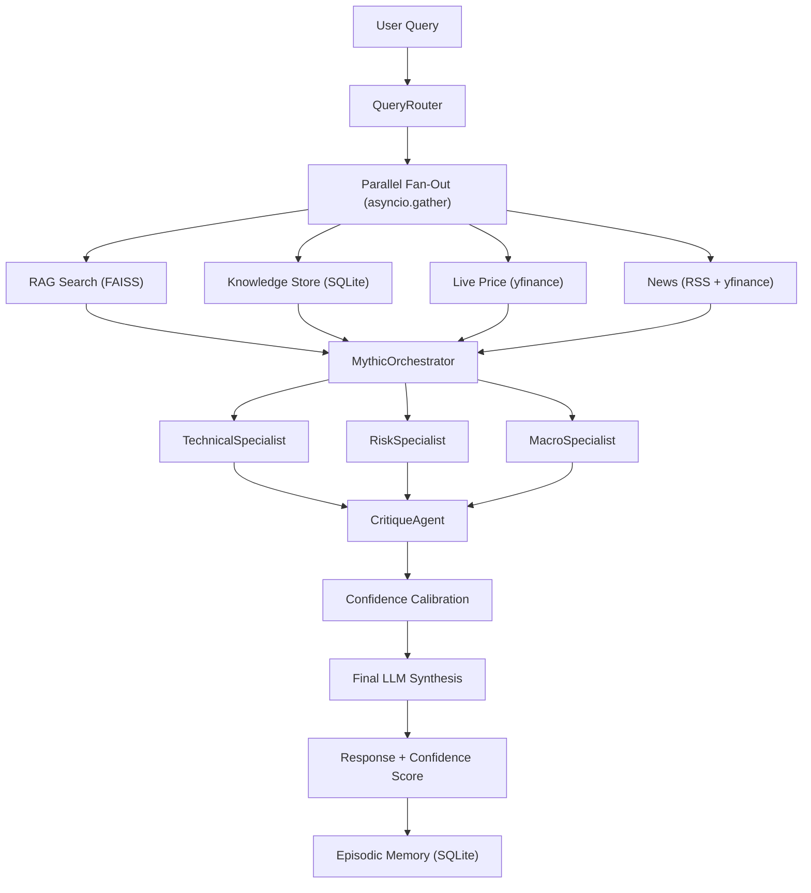

# AXIOM V4 Mythic-Tier Architecture — Walkthrough

## Summary

Upgraded the AXIOM trading platform from V3 (single-pass LLM) to V4 (Mythic-Tier multi-agent orchestrated reasoning) following the Claude Agent System architecture pattern, using **100% open-source tools** (local NVIDIA Nemotron GGUF / Ollama).

## Architecture Flow



---

## New Files Created

### [specialist_agents.py](file:///c:/Users/e629/Desktop/AITradra/agents/specialist_agents.py)
Three focused specialist agents, each extending [BaseAgent](file:///c:/Users/e629/Desktop/AITradra/agents/base_agent.py#33-114):
- **TechnicalSpecialist** — OHLCV patterns, support/resistance, momentum analysis
- **RiskSpecialist** — VaR(95%), max drawdown, beta, stress scenarios
- **MacroSpecialist** — News sentiment scoring, earnings signals, sector rotation

Each uses data-driven computation + LLM synthesis for structured JSON output.

### [critique_layer.py](file:///c:/Users/e629/Desktop/AITradra/agents/critique_layer.py)
- **CritiqueAgent** — Audits specialist outputs for contradictions (e.g., bullish technical + extreme risk)
- **[calibrate_confidence()](file:///c:/Users/e629/Desktop/AITradra/agents/critique_layer.py#138-176)** — Weighted formula: 40% agreement + 30% RAG density + 30% news recency

### [orchestrator.py](file:///c:/Users/e629/Desktop/AITradra/agents/orchestrator.py)
- **MythicOrchestrator** — Full ReAct loop:
  1. Parallel specialist dispatch (`asyncio.gather`)
  2. Critique/reflection layer
  3. Confidence calibration
  4. Final LLM synthesis with all context
  5. Episode storage for memory

### [db_portability.py](file:///c:/Users/e629/Desktop/AITradra/gateway/db_portability.py)
FastAPI router with 6 endpoints:
| Endpoint | Method | Description |
|---|---|---|
| `/api/db/status` | GET | DB size, table counts, backup history |
| `/api/db/export` | GET | SQL dump download |
| `/api/db/import` | POST | Upload `.sql` to restore DB |
| `/api/db/snapshot` | POST | Create timestamped backup |
| `/api/db/sync/export` | GET | JSON export for HTTP sync |
| `/api/db/sync/import` | POST | JSON merge with `INSERT OR IGNORE` |

### [test_endpoints.py](file:///c:/Users/e629/Desktop/AITradra/test_endpoints.py)
Comprehensive endpoint test script validating all API surface.

---

## Modified Files

### [query_router.py](file:///c:/Users/e629/Desktop/AITradra/agents/query_router.py)
- **Before**: Single LLM synthesis after sequential data gathering
- **After**: Parallel `asyncio.gather()` fan-out to all 4 data sources, routes through [MythicOrchestrator](file:///c:/Users/e629/Desktop/AITradra/agents/orchestrator.py#19-321), falls back to direct LLM if orchestrator fails

### [memory_manager.py](file:///c:/Users/e629/Desktop/AITradra/memory/memory_manager.py)
- **Before**: In-memory list for episodic storage (lost on restart)
- **After**: SQLite `agent_episodes` table with indexed search, conversation turn tracking, [SemanticMemory](file:///c:/Users/e629/Desktop/AITradra/memory/memory_manager.py#196-215) class delegating to FAISS RAG

### [server.py](file:///c:/Users/e629/Desktop/AITradra/gateway/server.py)
- Version bumped to `4.0.0`
- Imported `mythic_orchestrator` and `db_portability_router`
- Included DB portability router
- Added 5 mythic-tier agents to `/api/agents/status`
- Added `/api/pipeline/status` endpoint

---

## Verification

```bash
# Start the server
cd c:\Users\e629\Desktop\AITradra
python -m uvicorn gateway.server:app --host 0.0.0.0 --port 8000

# Run the endpoint tests
python test_endpoints.py

# Check Swagger docs
# Open http://localhost:8000/docs
```

All new endpoints will appear in the Swagger UI, and the chat pipeline now routes through the full mythic-tier orchestrator.
